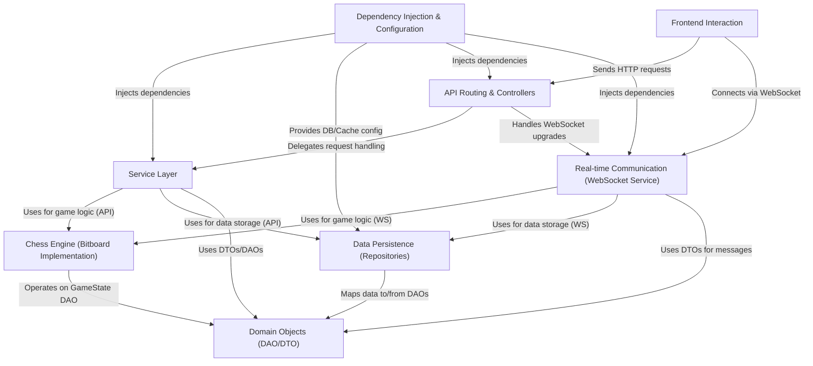

# chess

This project is a *web-based chess application*.
It allows two players to play chess against each other in *real-time*.
The core game logic uses a **Bitboard Chess Engine** for efficiency.
User interactions happen through a web interface (frontend), which communicates with the backend via API calls and WebSockets.
Game states and user data are stored in a **PostgreSQL database** and cached using **Redis**.

## Chapters

1. [Frontend Interaction](docs/01_frontend_interaction.md)
2. [Domain Objects (DAO/DTO)](docs/02_domain_objects__dao_dto_.md)
3. [API Routing & Controllers](docs/03_api_routing___controllers.md)
4. [Real-time Communication (WebSocket Service)](docs/04_real_time_communication__websocket_service_.md)
5. [Service Layer](docs/05_service_layer.md)
6. [Chess Engine (Bitboard Implementation)](docs/06_chess_engine__bitboard_implementation_.md)
7. [Data Persistence (Repositories)](docs/07_data_persistence__repositories_.md)
8. [Dependency Injection & Configuration](docs/08_dependency_injection___configuration.md)

---
