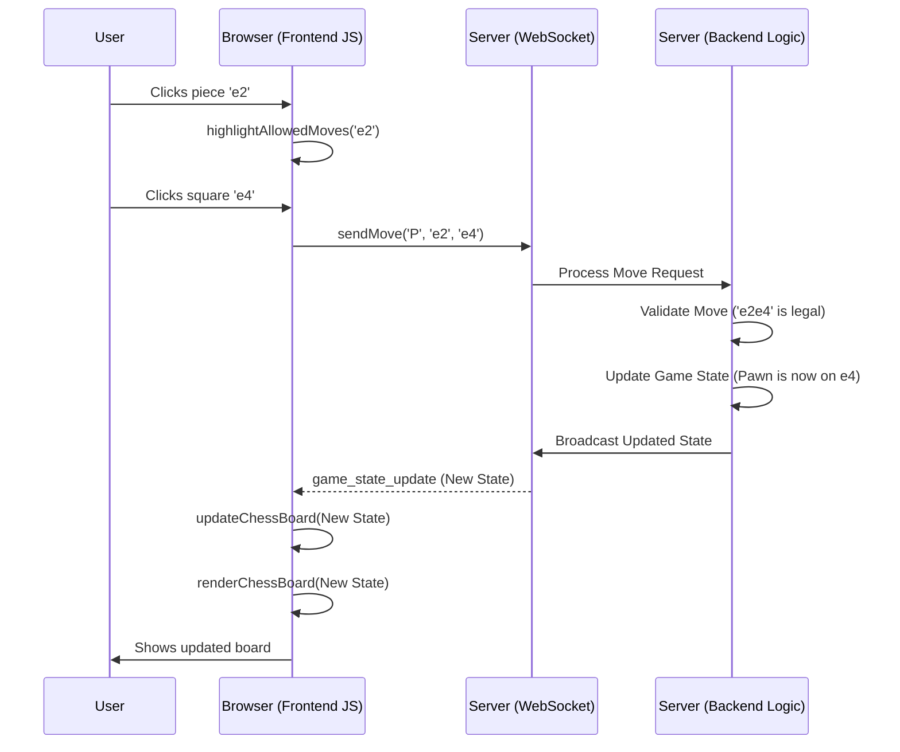

# Chapter 1: Frontend Interaction

Welcome to the Chess project! This is the very first chapter, and we'll start with what you, the player, see and interact with directly: the **Frontend**.

Imagine you're sitting down to play chess online. What do you need?

1.  You need to **see** the chessboard and the pieces.
2.  You need to be able to **click** or **drag** your pieces to make a move.
3.  You need to see your opponent's moves appear on the board.
4.  You need to see information like whose turn it is, player names, maybe even a timer.

The **Frontend Interaction** layer is responsible for all of this! It's the part of the application that runs right in your web browser (like Chrome, Firefox, or Safari).

Think of it like the dashboard and controls of a car. It shows you the speed (game state), lets you steer (make moves), and see the road (the board).

## What Problem Does the Frontend Solve?

The main problem the frontend solves is **connecting the human player to the digital chess game**. Without it, the chess game logic might exist on a server somewhere, but you'd have no way to see it or play!

**Use Case:** Let's take the simple action of **making a chess move**.

1.  You look at the board displayed on your screen.
2.  You decide to move your Pawn from square `e2` to `e4`.
3.  You click on the Pawn at `e2`. The square might light up, and potential moves might be highlighted.
4.  You then click on the destination square `e4`.
5.  *Magically*, the Pawn image moves from `e2` to `e4` on your screen.
6.  Your opponent (if playing online) will also see this move appear on their screen shortly after.

The frontend handles steps 1, 2, 3, 4, and 5, and works with other parts of the system (which we'll cover in later chapters) to make step 6 happen.

## Key Concepts: The Building Blocks

The frontend is mainly built using three core web technologies:

1.  **HTML (HyperText Markup Language):** The *Structure*. This defines all the elements you see on the page. Think of it as the blueprint for the chessboard `<div>`, the squares `<div>` inside it, the `` tags for piece images, and areas for player names.
2.  **CSS (Cascading Style Sheets):** The *Style*. This makes the HTML elements look good. It defines the colors of the dark and light squares, the size of the board, the font used for player names, and the specific images used for each piece.
3.  **JavaScript (JS):** The *Action*. This makes the page interactive and dynamic. It handles:
    *   Detecting your clicks and drags.
    *   Figuring out which piece or square you interacted with.
    *   Showing you which moves are allowed (highlighting squares).
    *   Sending your move to the game server.
    *   Receiving updates (like your opponent's move) from the server.
    *   Updating the HTML and CSS to reflect changes (moving pieces, updating whose turn it is).

## How It Works: Making a Move (Example)

Let's revisit our Pawn move (`e2` to `e4`) and see how the frontend code makes it happen.

**1. Displaying the Board:**

When the game page loads, JavaScript needs to draw the board and pieces. It first asks the server for the current game information.

```javascript
// File: app/static/js/board.js

// Function to get the game ID from the page URL (e.g., /game/abc-123)
function getGameIdFromURL() {
    const pathSegments = window.location.pathname.split('/');
    return pathSegments[pathSegments.length - 1];
}

const gameId = getGameIdFromURL();

// Ask the server for the game state
function fetchChessState() {
    // Use the fetch API to make a request to our backend
    fetch(`/api/chess/game/${gameId}`)
        .then(response => response.json()) // Get the response data as JSON
        .then(data => {
            // Once we have the data, draw the board
            renderChessBoard(data.data);
        })
        .catch(err => console.error('Error fetching chess state:', err));
}

// Call this function when the page loads
fetchChessState();
```

This code snippet first finds the unique ID for the current game from the web address. Then, it uses the browser's `fetch` function to send a request to a specific URL on our server (`/api/chess/game/...`). This is like asking the server, "Hey, what's the status of this game?". When the server responds with the game data, the `renderChessBoard` function (which we'll look at next) is called to actually draw everything. This communication uses a standard web request, often called an API call, which we'll cover more in [API Routing & Controllers](03_api_routing___controllers.md).

**2. Rendering the Board (`renderChessBoard`):**

This function takes the game data received from the server and uses it to create the visual representation.

```javascript
// File: app/static/js/board.js

const chessBoard = document.getElementById('chess-board'); // Find the main board container in HTML
const pieceMap = { "P": "/static/images/wP.svg", /* ... other pieces ... */ };

function renderChessBoard(gameData) {
    chessBoard.innerHTML = ''; // Clear the board first

    const currentState = gameData.current_state; // e.g., {"e2": "P", "e7": "p", ...}
    const boardLayout = gameData.board_layout; // Describes square names and colors

    // Loop through each row and square defined in the layout
    boardLayout.forEach((row, _) => {
        row.forEach((squareInfo, _) => {
            const [squareKey, color] = squareInfo; // e.g., ["e2", "light"]
            const square = document.createElement('div'); // Create an HTML div for the square
            square.className = `square ${color === 'w' ? 'light' : 'dark'}`;
            square.dataset.key = squareKey; // Store the square name (e.g., "e2")

            const pieceCode = currentState[squareKey]; // Is there a piece on this square?
            if (pieceCode) {
                // If yes, create an image element for the piece
                const img = document.createElement('img');
                img.src = pieceMap[pieceCode]; // Get image path based on piece code (e.g., "P")
                img.className = 'piece-image';
                img.draggable = true; // Allow dragging
                img.dataset.code = pieceCode;

                // *** Add event listeners for interaction (explained next) ***
                img.addEventListener('dragstart', handleDragStart);
                square.appendChild(img); // Add the piece image to the square
            }

            // *** Add event listeners for interaction (explained next) ***
            square.addEventListener('dragover', handleDragOver);
            square.addEventListener('drop', handleDrop);
            square.addEventListener('click', handleSquareClick); // Added for click-moves

            chessBoard.appendChild(square); // Add the square to the board
        });
    });
    // ... code to render player info, moves list etc. ...
    renderPlayerBars(gameData);
    renderMoves(gameData);
    highlightLastMove(gameData);
}
```

This is the core drawing function. It clears any old board, then loops through the `board_layout` provided by the server. For each square, it creates an HTML `div` element, styles it (light or dark), and adds data (`dataset.key`) to identify it later (like "e2"). If the `currentState` data shows a piece belongs on that square, it creates an `img` element, sets its source (`src`) to the correct piece image, and adds it to the square. Crucially, it also attaches *event listeners* (`addEventListener`) to the pieces and squares – these tell the browser to run specific JavaScript functions when the user interacts (clicks, drags, drops).

**3. Handling User Input (Clicking/Dragging):**

When you click or start dragging a piece, the event listeners trigger JavaScript functions.

```javascript
// File: app/static/js/board.js

let selectedPiece = null; // Track the currently selected piece element
let selectedSquare = null; // Track the currently selected square element
let legalMoves = {}; // Stores allowed moves, fetched with game state

// Called when you CLICK a piece (simplified)
function handlePieceClick(pieceElement, squareElement) {
    clearHighlightedSquares(); // Remove previous highlights

    // If clicking the same piece, deselect it
    if (selectedPiece === pieceElement) {
        selectedPiece = null;
        selectedSquare = null;
        return;
    }

    selectedPiece = pieceElement; // Remember the clicked piece
    selectedSquare = squareElement; // Remember its square
    highlightAllowedMoves(squareElement.dataset.key); // Show where it can go
}

// Called when you DRAG a piece
function handleDragStart(event) {
    // Store info about the dragged piece for later use
    event.dataTransfer.setData('text/plain', JSON.stringify({
        pieceCode: event.target.dataset.code, // e.g., "P"
        sourceKey: event.target.closest('.square').dataset.key // e.g., "e2"
    }));
    // ... (can add visual feedback like ghost image) ...
}

// Called when you DROP a piece onto a square
function handleDrop(event) {
    event.preventDefault(); // Prevent default browser action
    const data = JSON.parse(event.dataTransfer.getData('text/plain'));
    const targetSquare = event.target.closest('.square');

    if (targetSquare) {
        // We have the source (from dragStart) and target (from drop)
        // Now, tell the server about the move
        sendMove(data.pieceCode, data.sourceKey, targetSquare.dataset.key);
    }
}
```

*   `handlePieceClick`: Remembers which piece and square you clicked (`selectedPiece`, `selectedSquare`) and calls `highlightAllowedMoves` (not shown in detail here, but it would look up `legalMoves` fetched earlier and add a CSS class to highlight valid destination squares).
*   `handleDragStart`: When you start dragging, it stores the piece type and its starting square (`sourceKey`) using the browser's drag-and-drop data transfer mechanism.
*   `handleDrop`: When you release the mouse button over a square, it gets the stored `sourceKey` and the `targetSquare`'s key. It then calls `sendMove` to notify the server.

**4. Sending the Move:**

The `sendMove` function doesn't talk to the regular API. For real-time updates (seeing moves instantly), we use a different technology called WebSockets.

```javascript
// File: app/static/js/socket.js

let socket; // The WebSocket connection object

// Function to send a move object to the WebSocket server
function sendMove(piece, source, destination) {
    const moveData = {
        type: "game_update", // Type of message
        payload: {
            piece: piece,          // e.g., "P"
            source: source,        // e.g., "e2"
            destination: destination, // e.g., "e4"
            game_id: gameId,       // ID of the game
            token: localStorage.getItem('userToken'), // User identification
        }
    };

    // Check if the connection is open before sending
    if (socket && socket.readyState === WebSocket.OPEN) {
        socket.send(JSON.stringify(moveData)); // Send the data as a JSON string
        console.log("Move sent:", moveData);
    } else {
        console.error("WebSocket is not open. Cannot send move.");
    }
}
```

This code prepares a structured message (`moveData`) containing the move details and sends it over the WebSocket connection (`socket.send`). Think of WebSockets as a persistent phone line between your browser and the server, allowing instant two-way communication. We'll learn more about this in [Real-time Communication (WebSocket Service)](04_real_time_communication__websocket_service_.md).

**5. Receiving Updates and Updating the Board:**

The server processes the move, updates the game state, and sends a message *back* to all connected players (including you) via the WebSocket.

```javascript
// File: app/static/js/socket.js

// This function runs when a message is received from the WebSocket server
socket.onmessage = (event) => {
    const message = JSON.parse(event.data); // Parse the incoming JSON message
    console.log("Message received:", message);

    if (message.type === "game_state_update" || message.status === "success") {
        // If it's a successful update, redraw the board with the new state
        updateChessBoard(message.payload); // Use the data inside 'payload'
    } else if (message.status === "error") {
        // Handle potential errors (e.g., illegal move)
        console.error("Server error:", message.message);
        // Optionally, show an error to the user
    }
};

// Function to handle the received update
function updateChessBoard(payload) {
    // The payload contains the full new game state
    renderChessBoard(payload); // Re-render the board using the new data

    // Play a sound for feedback
    const moveSound = new Audio(/* sound file URL */);
    moveSound.play();
}

// Function to establish the WebSocket connection (simplified)
function createWebSocket() {
    const protocol = window.location.protocol === "https:" ? "wss" : "ws";
    socket = new WebSocket(`${protocol}://${window.location.host}/ws/${gameId}`);
    // ... assign socket.onmessage, socket.onopen, socket.onclose, socket.onerror ...
    // (Error handling and reconnection logic is important here too)
}

// Start the connection when the page loads
createWebSocket();
```

The `socket.onmessage` function is automatically called by the browser whenever a WebSocket message arrives. It parses the message data. If the message indicates a successful update (`game_state_update` or `status: "success"`), it calls `updateChessBoard`. This function simply calls our existing `renderChessBoard` function again, but this time with the *new* game state received from the server. This redraws the board, showing the piece in its new position (`e4`) and updating player info (like whose turn it is). It also plays a little sound effect for nice feedback!

## Under the Hood: A Quick Diagram

Here's a simplified sequence of how making a move flows through the system:



This diagram shows the interaction:
1.  User interacts with the Browser (Frontend JS).
2.  Frontend JS sends the move intent via WebSocket.
3.  The WebSocket server passes it to the Backend Logic.
4.  Backend Logic validates, updates the state, and tells the WebSocket server.
5.  WebSocket server sends the new state back to the Browser (Frontend JS).
6.  Frontend JS receives the update and redraws the board.

## Other Frontend Tasks

Besides the core game interaction, the frontend also handles:

*   **User Identification:** When you first visit, it might get a unique token for you.
    ```javascript
    // File: app/static/js/index.js (Simplified concept)
    async function fetchUserToken() {
        // Check if we already have a token/user info stored locally
        let userToken = localStorage.getItem('userToken');
        if (!userToken) {
            // If not, ask the server to create a new user/token
            const response = await fetch('/api/user', { method: 'POST' });
            // ... store the received token in localStorage ...
        }
        // ... display user info if available ...
    }
    fetchUserToken(); // Run on load
    ```
*   **Creating/Joining Games:** On the home page, buttons allow you to start a new game or join one using an invite code. This usually involves API calls.
    ```javascript
    // File: app/static/js/home.js (Simplified concept)
    createGameButton.addEventListener('click', () => {
        fetch('/api/chess/game', { method: 'POST', /* ... user token ... */ })
            .then(res => res.json())
            .then(data => {
                // If successful, redirect to the new game page
                window.location.href = `/game/${data.data}`;
            });
    });
    ```
*   **Displaying Game Lists:** Fetching and showing available games to join.
*   **Displaying History:** Showing the list of moves made so far.

## Conclusion

Phew! That was a dive into the Frontend Interaction layer. We saw how HTML gives structure, CSS adds style, and JavaScript brings the chessboard to life. It handles displaying the game, capturing your clicks and drags, sending moves to the server using WebSockets, and updating the view when new information arrives. It's the visual and interactive heart of the player's experience.

While the frontend makes the game playable, it relies heavily on other parts of the system to function correctly. It needs well-structured data to display, an API to call for initial information, and a WebSocket service for real-time communication.

In the next chapter, we'll look at how data is organized and passed around within the application. Let's explore [Domain Objects (DAO/DTO)](02_domain_objects__dao_dto_.md).

---

<script type="module">
    import mermaid from 'https://cdn.jsdelivr.net/npm/mermaid@11/dist/mermaid.esm.min.mjs';
    mermaid.initialize({ startOnLoad: true });
</script>