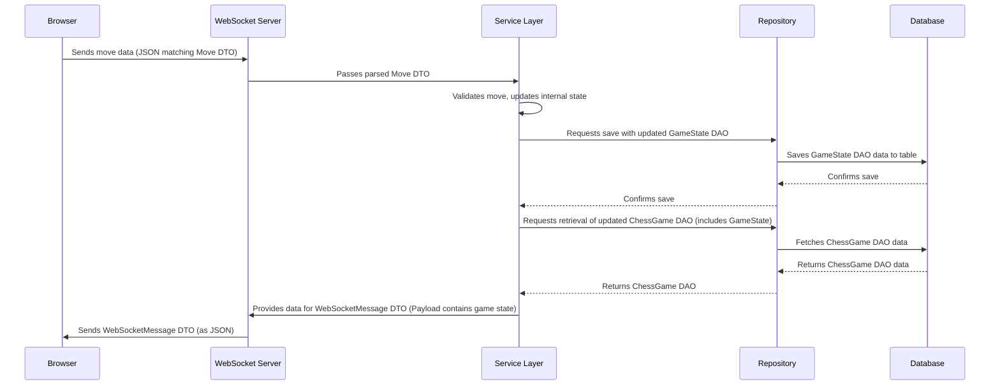

# Chapter 2: Domain Objects (DAO/DTO) - Organizing Our Information

Welcome back! In [Chapter 1: Frontend Interaction](01_frontend_interaction.md), we saw how the user interacts with the chessboard in their browser. We saw JavaScript code sending messages like `moveData` to the server. But how does the server understand these messages? And how does it store game information permanently?

This is where **Domain Objects** come in. Think of them as **standardized forms** or **blueprints** for information used throughout our chess application.

## What Problem Do Domain Objects Solve?

Imagine you're sending a package. You need a specific format for the address label (Name, Street, City, Zip Code) so the postal service knows how to handle it. Similarly, different parts of our application (like the frontend, the backend server logic, and the database) need to exchange information in a predictable, agreed-upon format.

Without these standardized forms, it would be chaos! The frontend might send move information like `"move Pawn from E2 to E4"`, while the database might expect something like `{piece: 'P', start: 6, end: 22}`. How would they understand each other?

Domain Objects solve this by defining clear structures for our data.

**Use Case:** Let's follow the information for a single chess move (`e2` to `e4`) as it travels through the system:

1.  **Browser to Server:** Your browser needs to send the move details (piece, start square, end square, game ID, your identity token) to the server.
2.  **Server Logic:** The server receives this information, understands it, checks if the move is valid, and updates the game's state.
3.  **Server to Database:** The server needs to save the new game state (whose turn it is, piece positions, etc.) so it's not lost if the server restarts.
4.  **Server to Browser (Others):** The server needs to tell your opponent's browser about the move that just happened.

Domain objects provide the "forms" needed for each step.

## Key Concepts: DTOs vs. DAOs

We primarily use two types of Domain Objects:

1.  **DTO (Data Transfer Object):** The "Shipping Label" or "Envelope"
    *   **Purpose:** Designed specifically for *transferring* data between different parts of the application, especially across boundaries like the network (Browser <-> Server) or between major logical layers inside the server.
    *   **Analogy:** Think of a specific envelope designed to send a particular type of document. It has clearly marked fields for sender, recipient, and maybe a content description. It's optimized for the journey, not necessarily for long-term storage.
    *   **Examples:**
        *   The `moveData` we saw in Chapter 1 is packaged into a `Move` DTO.
        *   When the server sends a response back (like success or an error), it often uses an `ApiResponse` DTO.
        *   WebSocket messages often use a `WebSocketMessage` DTO.

2.  **DAO (Data Access Object):** The "Filing Cabinet Record" or "Database Blueprint"
    *   **Purpose:** Designed to represent data exactly as it's stored (or close to it) in our database. They map directly to database tables.
    *   **Analogy:** Think of a detailed record stored in a filing cabinet, or the blueprint defining the columns and data types in a database table. It's structured for efficient storage and retrieval.
    *   **Examples:**
        *   `User` DAO: Represents a row in the `users` database table (ID, Name, Token, etc.).
        *   `ChessGame` DAO: Represents a row in the `chess_games` table (ID, Invite Code, Players, etc.).
        *   `GameState` DAO: Represents the detailed state of a game board in the `game_states` table (piece positions using bitboards, whose turn, etc.).

**Why the difference?** Sometimes, the data you want to *send* (DTO) is slightly different from how you want to *store* it (DAO). For example, when sending the game state to the browser (DTO), you might include calculated information like a list of legal moves. But in the database (DAO), you might only store the fundamental piece positions, calculating legal moves on demand. Using both allows flexibility.

## How It Works: Following the Move Data

Let's see how DTOs and DAOs handle our `e2` to `e4` move.

**1. Browser Sends a DTO:**

In Chapter 1, our JavaScript created `moveData`. This corresponds directly to a DTO defined in our Go backend code.

```go
// File: app/domain/dto/chess_request.go

// Move DTO: The 'form' for sending a move from Browser to Server
type Move struct {
	Piece       string `json:"piece"` // e.g., "P" (Pawn)
	Source      string `json:"source"` // e.g., "e2"
	Destination string `json:"destination"` // e.g., "e4"
	GameId      string `json:"game_id"` // ID of the game being played
	Token       string `json:"token"` // Identifies the user making the move
}
```

This Go `struct` defines the `Move` DTO. The `json:"..."` tags tell Go how to automatically convert this structure to/from the JSON format that JavaScript understands. When the browser sends the move via WebSocket, it sends JSON data that perfectly matches this structure.

**2. Server Receives the DTO:**

The Go WebSocket handler receives the JSON message and easily converts it back into the `Move` DTO structure because it knows the expected "form".

**3. Server Updates State and Uses a DAO:**

After validating the move (`e2` to `e4` is legal), the server logic updates the internal representation of the game. To save this new state, it needs to interact with the database using a DAO.

```go
// File: app/domain/dao/chess.go (Simplified)

// GameState DAO: The 'blueprint' for storing game state in the database
type GameState struct {
	ID             int    `gorm:"primaryKey;autoIncrement"` // Database ID
	GameID         int    `gorm:"not null"` // Which game this state belongs to
	// ... Bitboards representing piece positions ...
	PawnBitboard   uint64 `gorm:"type:numeric(20,0)"`
	// ... other pieces ...
	Turn           string `gorm:"type:varchar(1);not null"` // Whose turn ('w' or 'b')
	LastMove       string `gorm:"type:varchar(10)"` // The move just made (e.g., "e2e4")
	// ... other fields like castling rights, en passant ...
	BaseModel // Includes CreatedAt, UpdatedAt etc.
}
```

This `GameState` DAO struct mirrors the columns in our `game_states` database table. The server logic takes the updated game information (Pawn now on `e4`, it's Black's turn) and populates an instance of this `GameState` DAO. This DAO is then handed off to the [Data Persistence (Repositories)](07_data_persistence__repositories_.md) layer to be saved. The `gorm:"..."` tags help the database library (GORM) map struct fields to table columns.

**4. Server Sends Updates Using DTOs:**

The server needs to notify all connected players about the successful move and the new game state. It uses another DTO for this, often wrapping the game data inside a standard message format.

```go
// File: app/domain/dto/websocket.go

// WebSocketMessage DTO: Standard 'envelope' for WebSocket communication
type WebSocketMessage struct {
	Type    string      `json:"type"`    // e.g., "game_state_update"
	Status  string      `json:"status"`  // e.g., "success"
	Message string      `json:"message"` // Optional info message
	// Payload can contain *another* DTO or DAO (or parts of one)
	Payload interface{} `json:"payload"`
}
```

The server might create a `WebSocketMessage` where `Type` is `"game_state_update"`, `Status` is `"success"`, and `Payload` contains the relevant parts of the updated game state (perhaps derived from the `ChessGame` DAO, maybe including calculated legal moves - a specialized DTO for the frontend). This `WebSocketMessage` is then converted to JSON and sent back to the browsers.

We also use DTOs for regular API responses:

```go
// File: app/domain/dto/api_response.go

// ApiResponse DTO: Standard 'form' for regular API responses
type ApiResponse[T any] struct {
	ResponseKey     string `json:"response_key"` // e.g., "GAME_STATE_FETCHED"
	ResponseMessage string `json:"response_message"` // e.g., "Successfully retrieved game state"
	Data            T      `json:"data"` // The actual data (could be a DAO or another DTO)
}
```

When the frontend initially fetches the game state using `fetch` (like in Chapter 1), the server wraps the `ChessGame` data (likely containing the `GameState`) inside this `ApiResponse` DTO before sending it back as JSON.

## Under the Hood: The Flow of Information

Let's visualize the journey of our `e2e4` move data:



1.  **Browser:** Creates JSON matching the `Move` DTO structure.
2.  **WebSocket Server:** Receives JSON, converts it into a Go `Move` DTO object.
3.  **Service Layer:** Takes the `Move` DTO, performs game logic. Creates/updates a `GameState` DAO object.
4.  **Repository:** Takes the `GameState` DAO, translates it into database commands (SQL INSERT/UPDATE).
5.  **Database:** Stores the data based on the `GameState` DAO structure.
6.  **(Response Path):** Repository fetches data, populating `ChessGame`/`GameState` DAOs.
7.  **Service Layer:** Takes DAOs, extracts/calculates data needed for the frontend, puts it into the `Payload` of a `WebSocketMessage` DTO.
8.  **WebSocket Server:** Converts the `WebSocketMessage` DTO into JSON and sends it to the browser(s).

The key idea is **transformation**: Data arrives as one type of "form" (DTO), gets processed, might be stored using a different "form" (DAO), and then potentially sent out again using yet another "form" (DTO).

## Conclusion

Domain Objects (DTOs and DAOs) are essential organizers. They act like standardized forms, ensuring that different parts of our application – the browser, the server logic, the database – can communicate clearly and consistently.

*   **DTOs (Data Transfer Objects):** Like envelopes or shipping labels, designed for sending data across boundaries (network, internal layers). Examples: `Move`, `ApiResponse`, `WebSocketMessage`.
*   **DAOs (Data Access Objects):** Like database blueprints or filing records, designed to map closely to how data is stored. Examples: `User`, `ChessGame`, `GameState`.

By defining these structures, we make our code easier to understand, maintain, and less prone to errors caused by mismatched data formats.

In the next chapter, we'll see how the server receives requests (like fetching game state or handling move submissions) and directs them to the correct logic using [API Routing & Controllers](03_api_routing___controllers.md).

---

<script type="module">
    import mermaid from 'https://cdn.jsdelivr.net/npm/mermaid@11/dist/mermaid.esm.min.mjs';
    mermaid.initialize({ startOnLoad: true });
</script>