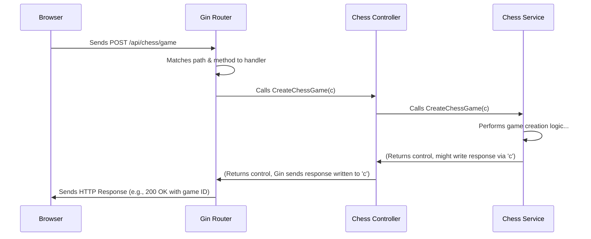

# Chapter 3: API Routing & Controllers - The Application's Reception Desk

Welcome back! In [Chapter 2: Domain Objects (DAO/DTO)](02_domain_objects__dao_dto_.md), we learned how our application organizes data using standardized "forms" like DTOs and DAOs. Now, imagine the frontend (your browser) wants to use one of these forms to ask the server to do something, like create a new chess game. How does the server receive this request and know *what* to do and *which* part of its code should handle it?

That's where **API Routing** and **Controllers** step in!

## What Problem Do Routing & Controllers Solve?

Think of our server application as a large office building. Many different departments handle various tasks (managing users, handling chess games, etc.). When a request arrives (like a visitor or a phone call), someone needs to figure out:

1.  Who is this request for? (Which department?)
2.  What do they want? (What specific action?)

Without a reception desk or a directory, visitors would wander aimlessly!

**API Routing & Controllers** act as this reception desk and directory for web requests. The **Router** looks at the incoming request's address (the URL path, like `/api/chess/game`) and the method (like `POST` for creating something, or `GET` for fetching something). Based on this, it directs the request to the correct "department" – the **Controller**. The Controller then takes over, understands the specifics of the request, and coordinates the actual work.

**Use Case:** Let's focus on **Creating a New Chess Game**.

1.  You click the "Create New Game" button on the website (the Frontend).
2.  Your browser sends a `POST` request to the server at the URL `/api/chess/game`. This request might also include your user identification token.
3.  The **Router** on the server sees `POST /api/chess/game`.
4.  The Router knows this specific address and method combination should be handled by the `ChessController`'s `CreateChessGame` function.
5.  The `CreateChessGame` function (part of the **Controller**) takes the request, figures out which user is asking, asks the main game logic (the "Service") to set up a new game, and then prepares a response (like the new game's ID) to send back to your browser.

## Key Concepts: The Reception Desk and the Department

1.  **Router (The Building Directory / Traffic Controller):**
    *   **Purpose:** To look at the "address" (URL path) and "intent" (HTTP method: GET, POST, PUT, DELETE) of an incoming request.
    *   **Job:** Based on the path and method, it matches the request to a specific handler function (usually a method within a Controller). It doesn't care about the *details* of the request (like the data being sent), only where it needs to go.
    *   **Analogy:** Like a traffic light system directing cars based on road signs, or a building directory telling you "Accounting is on Floor 3, Room 301".

2.  **Controller (The Department Office / Receptionist):**
    *   **Purpose:** To receive requests routed to it and manage the process of fulfilling that request.
    *   **Job:**
        *   Parses the details of the incoming request (e.g., reads data sent in a POST request, extracts parameters from the URL like a game ID).
        *   Often validates the incoming data (using DTOs we saw in [Chapter 2: Domain Objects (DAO/DTO)](02_domain_objects__dao_dto_.md)).
        *   Calls the appropriate business logic components (which we'll call "Services" in [Chapter 5: Service Layer](05_service_layer.md)) to do the actual work (like creating the game, fetching data, making a move).
        *   Prepares the response to send back to the client (browser), often packaging data into `ApiResponse` DTOs.
    *   **Analogy:** Like the receptionist in the Accounting department (Room 301). They take your specific form, check if it's filled correctly, pass it to the right accountant (the Service), get the result, and give it back to you.

## How It Works: Creating a New Game (Example)

Let's trace the "Create New Game" request: `POST /api/chess/game`.

**1. Defining the Route:**

Somewhere in our server setup, we need to tell the Router about this specific path and method. We use a library called `Gin` in our Go project for this.

```go
// File: app/router/route.go (Simplified)

package router

import (
	"chess-engine/config" // Contains initialized controllers
	"github.com/gin-gonic/gin"
)

func Init(init *config.Initialization) *gin.Engine {
	router := gin.New()
	// ... other setup ...

	// Group API routes under /api
	api := router.Group("/api")
	{
		// Group chess-related routes under /api/chess
		chess := api.Group("/chess")
		{
			// When a POST request comes to /api/chess/game,
			// call the CreateChessGame function on our ChessController.
			chess.POST("/game", init.ChessCtrl.CreateChessGame)

			// Other chess routes defined here...
			// e.g., GET /api/chess/game/:gameId calls GetChessGameById
			chess.GET("/game/:gameId", init.ChessCtrl.GetChessGameById)
		}
		// ... user routes etc. ...
	}
	return router
}
```

This code sets up our Router. The key line is `chess.POST("/game", init.ChessCtrl.CreateChessGame)`. It tells the `Gin` router: "If you receive a `POST` request specifically for the path `/api/chess/game`, you must execute the `CreateChessGame` function found within the `init.ChessCtrl` object." (`init.ChessCtrl` is our instance of `ChessController`).

**2. The Controller Function:**

Now let's look at the `ChessController` and its `CreateChessGame` function.

```go
// File: app/controller/chess_controller.go (Simplified)

package controller

import (
	"chess-engine/app/service" // We'll need the service later
	"github.com/gin-gonic/gin" // Gin framework context
)

// Interface defining what a ChessController can do
type ChessController interface {
	CreateChessGame(c *gin.Context)
	GetChessGameById(c *gin.Context)
	// ... other methods like JoinChessGame, MakeMove ...
}

// Implementation of the ChessController
type ChessControllerImpl struct {
	svc service.ChessService // The controller uses a ChessService to do the real work
}

// The function that gets called by the router for POST /api/chess/game
func (ctrl ChessControllerImpl) CreateChessGame(c *gin.Context) {
	// The 'c *gin.Context' object holds all request details (headers, body, etc.)
	// and allows us to send a response.

	// Step 1: (Simplified) Extract user info maybe from the request context 'c'
	// Step 2: Call the ChessService to actually create the game
	ctrl.svc.CreateChessGame(c) // Delegate the real work to the service

	// Step 3: The service (or this controller) will use 'c' to send
	//         the response back to the browser (e.g., success and new game ID).
	//         This is often done inside the service method itself in our structure.
}

// Function to create a new ChessController
func ChessControllerInit(chessService service.ChessService) *ChessControllerImpl {
	return &ChessControllerImpl{
		svc: chessService, // Store the service for later use
	}
}
```

This shows the `ChessControllerImpl` structure holding a reference to a `ChessService` (more on this in [Chapter 5: Service Layer](05_service_layer.md)). When the router calls `CreateChessGame`, it passes a `gin.Context` object (`c`). This magic object contains everything about the incoming request (like headers, who sent it, any data attached) and also provides methods to send a response back (`c.JSON(...)`, `c.String(...)`, etc.).

Notice that the controller itself doesn't contain the complex logic for *how* to create a game. It primarily:
1.  Receives the request via `c`.
2.  Delegates the actual work by calling `ctrl.svc.CreateChessGame(c)`.
3.  The service layer (or sometimes the controller after the service call returns) uses `c` to send the final HTTP response back to the browser.

## Under the Hood: The Request Journey

Let's trace the request flow with a diagram:



1.  **Browser:** Sends the `POST` request.
2.  **Gin Router:** Receives the raw HTTP request. It parses the method (`POST`) and path (`/api/chess/game`). It looks up its internal table (built by `router.POST(...)` calls) and finds a match pointing to the `ChessControllerImpl.CreateChessGame` function.
3.  **Gin Router:** Calls the matched function, passing the `gin.Context` (`c`) which encapsulates the request.
4.  **Chess Controller (`CreateChessGame`):** Executes. It might extract data from `c` if needed (e.g., user token). It then calls the `ChessService`'s `CreateChessGame` method, often passing `c` along so the service can also access request details or send the response directly.
5.  **Chess Service:** Does the heavy lifting – interacts with game logic, potentially saves data to the database (using DAOs from [Chapter 2](02_domain_objects__dao_dto_.md) and Repositories from [Chapter 7](07_data_persistence__repositories_.md)). It then uses `c` (e.g., `c.JSON(200, responseDTO)`) to write the HTTP status code (like `200 OK`) and the response body (like an `ApiResponse` DTO containing the new game ID) back to the client.
6.  **Controller/Router/Browser:** Control returns up the chain, and the Gin framework sends the prepared HTTP response back to the waiting browser.

The key takeaway is the clear separation of concerns:
*   **Router:** Knows *where* requests should go based on URL and method.
*   **Controller:** Knows *what* to do for a specific request – parses input, calls services, prepares output format.
*   **Service:** Knows *how* to perform the actual business logic.

## Conclusion

We've seen how API Routing and Controllers act as the entry point for handling standard web requests in our chess application.

*   The **Router** (like Gin) acts as a traffic director, matching incoming request URLs and HTTP methods (GET, POST) to specific Controller functions.
*   The **Controller** acts as a manager for that request type. It receives the request details, delegates the core logic to a **Service**, and ensures a response is sent back.

This structure keeps our code organized. Routers handle the "where", Controllers handle the "what" (coordination), and Services (which we'll explore later) handle the "how" (the actual work).

This mechanism is great for actions like creating games, joining games, fetching user profiles, or getting the initial state of a game. However, for the fast, back-and-forth communication needed *during* a game (like sending and receiving moves instantly), we use a different approach.

In the next chapter, we'll dive into how real-time communication works using WebSockets: [Real-time Communication (WebSocket Service)](04_real_time_communication__websocket_service_.md).

---

<script type="module">
    import mermaid from 'https://cdn.jsdelivr.net/npm/mermaid@11/dist/mermaid.esm.min.mjs';
    mermaid.initialize({ startOnLoad: true });
</script>