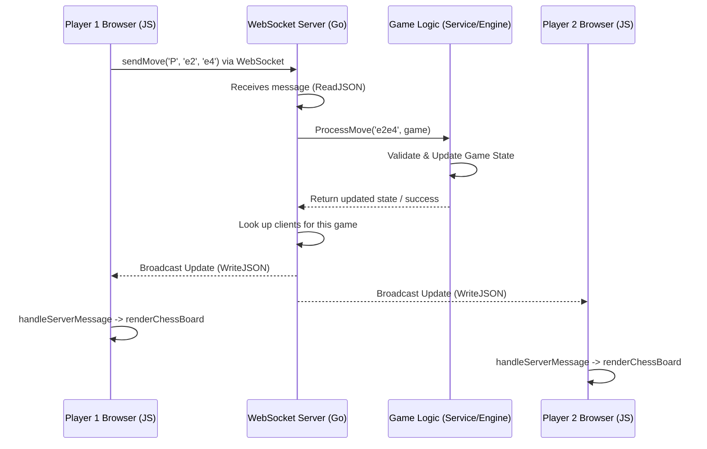

# Chapter 4: Real-time Communication (WebSocket Service)

Welcome back! In [Chapter 3: API Routing & Controllers](03_api_routing___controllers.md), we saw how our server handles standard requests like creating a new game or fetching the initial game state. These requests are like asking a question and getting a single answer back. But what happens *during* the game? When your opponent makes a move, you want to see it instantly, right? You don't want to keep hitting the refresh button!

This is where our **Real-time Communication (WebSocket Service)** comes in. It's the magic that makes online chess feel truly live.

## What Problem Does the WebSocket Service Solve?

Imagine you're playing chess with a friend online. Your friend moves their Knight. How does your screen update to show that move *immediately*?

With the standard HTTP requests we saw in Chapter 3, your browser would have to constantly ask the server, "Did anything change? Did anything change? Did anything change?". This is inefficient and slow.

The WebSocket Service solves this by creating a **persistent, two-way communication channel** between your browser and the server, specifically for your game. Think of it like opening a dedicated phone line or an instant messenger chat just for your chess match.

**Use Case:** Let's follow what happens when **Player 1 makes a move** and **Player 2 sees it instantly**:

1.  Player 1 moves their Pawn from `e2` to `e4` in their browser.
2.  Player 1's browser sends a message containing this move (`e2e4`) through the WebSocket "phone line" to the server.
3.  The WebSocket Service on the server receives the message.
4.  The service processes the move (checks if it's legal, updates the game state - we'll see how in [Chapter 5: Service Layer](05_service_layer.md)).
5.  The service then finds the "phone line" connected to Player 2's browser.
6.  It sends a message *down* Player 2's line, saying "Hey, the board has been updated! The move was `e2e4`."
7.  Player 2's browser receives this message instantly and redraws the board to show the Pawn on `e4`.

No page refresh needed! It feels instantaneous.

## Key Concepts: The Instant Messenger for Your Game

1.  **WebSocket Connection:** Unlike a normal web request (ask, answer, hang up), a WebSocket connection stays open. It's like keeping the phone line open for the entire duration of the game.
2.  **Two-Way Street:** Both the browser (client) and the server can send messages to each other at any time over this open connection. The server can "push" updates to the browser without the browser having to ask first.
3.  **The WebSocket Service (Server-Side):** This is the part of our Go application that manages all these open phone lines. It keeps track of which connection belongs to which player in which game. When a move comes in for Game `abc`, it knows which other connections are also watching Game `abc` and need the update.
4.  **Messages:** Data is sent back and forth as messages. In our case, these messages are typically structured data (using DTOs like `WebSocketMessage` from [Chapter 2: Domain Objects (DAO/DTO)](02_domain_objects__dao_dto_.md)) describing moves or game state updates.

## How It Works: Sending and Receiving a Move

Let's look at the code involved in making that instant update happen.

**1. Establishing the Connection (Client-Side JavaScript)**

When you load the game page, your browser needs to open this special WebSocket connection to the server.

```javascript
// File: app/static/js/socket.js

let socket; // Variable to hold our WebSocket connection
const gameId = /* get game ID from URL */; // e.g., "abc-123"

// Function to create the WebSocket connection
function createWebSocket() {
    // Determine protocol: 'ws' for http, 'wss' for https (secure)
    const protocol = window.location.protocol === "https:" ? "wss" : "ws";
    // Construct the WebSocket URL, including the game ID
    const wsUrl = `${protocol}://${window.location.host}/ws/${gameId}`;

    console.log("Connecting to WebSocket:", wsUrl);
    socket = new WebSocket(wsUrl); // Create the connection!

    // What to do when the connection successfully opens
    socket.onopen = () => {
        console.log("WebSocket connection established.");
        // Maybe send an initial message saying "I'm here!"
    };

    // *** What to do when a message ARRIVES from the server (see below) ***
    socket.onmessage = handleServerMessage;

    // ... error handling (socket.onerror) and closing (socket.onclose) ...
}

// Call this function when the game page loads
createWebSocket();
```

This JavaScript code figures out the correct address for the WebSocket server (`ws://yourserver.com/ws/abc-123`) and uses the browser's built-in `WebSocket` object to open the connection. It also sets up functions to handle events like the connection opening (`onopen`) or messages arriving (`onmessage`).

**2. Sending a Move (Client-Side JavaScript)**

Remember `sendMove` from Chapter 1? It uses the `socket` object we just created.

```javascript
// File: app/static/js/socket.js

// Function to send a move object to the WebSocket server
function sendMove(piece, source, destination) {
    const moveData = {
        type: "game_update", // Type of message
        payload: {
            piece: piece,          // e.g., "P"
            source: source,        // e.g., "e2"
            destination: destination, // e.g., "e4"
            game_id: gameId,       // ID of the game
            token: localStorage.getItem('userToken'), // User identification
        }
        // We'll wrap this in a standard WebSocketMessage DTO format
    };

    // Check if the connection is open before sending
    if (socket && socket.readyState === WebSocket.OPEN) {
        // Convert the data to a JSON string and send it
        socket.send(JSON.stringify(moveData));
        console.log("Move sent:", moveData);
    } else {
        console.error("WebSocket is not open. Cannot send move.");
    }
}
```

When Player 1 makes a move, this function packages the move details into a JSON message (matching our `WebSocketMessage` DTO structure, specifically within the `payload`) and sends it *up* the WebSocket "phone line" using `socket.send()`.

**3. Handling the Connection (Server-Side Go)**

On the server, our [API Routing & Controllers](03_api_routing___controllers.md) directs requests for `/ws/:gameId` to a special controller. This controller's job is to "upgrade" the standard HTTP request into a persistent WebSocket connection.

```go
// File: app/controller/websocket_controller.go (Simplified)

import (
	"github.com/gin-gonic/gin"
	"github.com/gorilla/websocket" // Library for WebSocket handling
	"net/http"
)

// ... WebSocketController struct holds the WebSocketService ...

// HandleWebSocket upgrades HTTP to WebSocket and starts listening.
func (wsCtrl WebSocketControllerImpl) HandleWebSocket(c *gin.Context) {
	gameID := c.Param("gameId") // Get game ID from URL ("/ws/:gameId")

	// 'Upgrader' helps switch from HTTP to WebSocket protocol
	upgrader := websocket.Upgrader{
		CheckOrigin: func(r *http.Request) bool { return true }, // Allow connections
	}

	// Perform the upgrade
	conn, err := upgrader.Upgrade(c.Writer, c.Request, nil)
	if err != nil {
		// Handle error: Failed to upgrade
		return
	}

	// IMPORTANT: Register this new connection with our service
	wsCtrl.svc.RegisterClient(gameID, conn)

	// Clean up when the client disconnects
	defer wsCtrl.svc.UnregisterClient(gameID, conn)

	// Loop forever, waiting for messages from *this* client
	for {
		var message dto.WebSocketMessage // Expect messages in our DTO format
		if err := conn.ReadJSON(&message); err != nil {
			// Error reading (client likely disconnected)
			break // Exit the loop to trigger the 'defer' cleanup
		}

		// Got a message! Ask the service to process it.
		wsCtrl.svc.ProcessMove(gameID, message)
	}
}
```

This Go code uses the `gorilla/websocket` library. `upgrader.Upgrade` performs the magic handshake to switch protocols. It then registers the `conn` (the connection object representing this specific client's "phone line") with the `WebSocketService`, associating it with the `gameID`. Finally, it enters a loop, waiting (`conn.ReadJSON`) to receive messages from that specific client. When a message arrives, it passes it to the `WebSocketService` for processing.

**4. Processing and Broadcasting (Server-Side Go)**

The `WebSocketService` is the central hub. It keeps track of all active connections for each game.

```go
// File: app/service/websocket_service.go (Simplified)

// Map storing game IDs -> map of connections for that game
// e.g., {"abc-123": {conn1: true, conn2: true}, "xyz-789": {conn3: true}}
var gameClients map[string]map[*websocket.Conn]bool
var mutex sync.Mutex // Protects access to gameClients

// RegisterClient adds a connection to a game
func (ws *WebSocketServiceImpl) RegisterClient(gameID string, conn *websocket.Conn) {
	ws.mutex.Lock()
	defer ws.mutex.Unlock()
	if _, exists := ws.gameClients[gameID]; !exists {
		ws.gameClients[gameID] = make(map[*websocket.Conn]bool)
	}
	ws.gameClients[gameID][conn] = true
	log.Infof("Client connected to game %s", gameID)
}

// ProcessMove handles an incoming move message
func (ws *WebSocketServiceImpl) ProcessMove(gameId string, message dto.WebSocketMessage) {
	log.Info("Processing move via WebSocket", message.Payload)

	// 1. Validate the move, update game state (calls ChessService/Engine)
	// ... logic to interact with game state ...
	// ... determine the updated game data ...

	// 2. Prepare the response message for broadcasting
	response := dto.WebSocketMessage{
		Type:    "game_update",
		Status:  "success", // Or "error" if move was illegal
		Payload: updatedGameData, // The new state/move info
	}

	// 3. Broadcast the response to *all* clients in the same game
	ws.BroadcastMessage(gameId, response)
}

// BroadcastMessage sends a message to all clients in a specific game
func (ws *WebSocketServiceImpl) BroadcastMessage(gameID string, message dto.WebSocketMessage) {
	ws.mutex.Lock()
	defer ws.mutex.Unlock()

	if clients, exists := ws.gameClients[gameID]; exists {
		log.Infof("Broadcasting to %d clients in game %s", len(clients), gameID)
		// Loop through all connections registered for this game
		for conn := range clients {
			// Send the JSON message down the wire
			err := conn.WriteJSON(message)
			if err != nil {
				log.Error("Error broadcasting: ", err)
				// Handle error (e.g., remove broken connection)
			}
		}
	}
}
```

The service uses a `map` (`gameClients`) to keep track of which connections (`*websocket.Conn`) belong to which `gameID`. When `ProcessMove` is called:
1.  It handles the game logic (often by calling other services like the [Service Layer](05_service_layer.md)).
2.  It crafts a response message (`dto.WebSocketMessage`).
3.  It calls `BroadcastMessage`. This function looks up the `gameID` in the `gameClients` map, finds all active connections for that game, and loops through them, sending (`conn.WriteJSON`) the response message to each one.

**5. Receiving the Update (Client-Side JavaScript)**

Remember the `onmessage` handler we set up earlier? This is where Player 2's browser receives the broadcasted message.

```javascript
// File: app/static/js/socket.js

// This function runs when a message is received from the server
function handleServerMessage(event) {
    const message = JSON.parse(event.data); // Parse the JSON message string
    console.log("Message received:", message);

    // Check if it's a game update
    if (message.type === "game_update" && message.status === "success") {
        // The actual game data is inside the 'payload'
        const gameData = message.payload;

        // Update the board visually!
        renderChessBoard(gameData); // Use the function from Chapter 1
        playMoveSound(); // Give audio feedback
    } else if (message.status === "error") {
        console.error("Server error:", message.message);
        // Show an error message to the user
    }
    // Could handle other message types too (chat, game over, etc.)
}

function playMoveSound() {
    const moveSound = new Audio(/* sound file URL */);
    moveSound.play().catch(e => console.log("Sound play failed", e));
}
```

When Player 2's browser receives the message via `socket.onmessage`, this code parses the JSON. If it's a successful `game_update`, it extracts the `payload` (which contains the new board layout, whose turn it is, etc.) and calls `renderChessBoard` (the same function used in Chapter 1 to draw the board initially) to update the display. It also plays a sound!

## Under the Hood: The Flow of an Instant Update

Let's visualize the journey of Player 1's move (`e2e4`) reaching Player 2:



1.  Player 1's browser sends the move over its open WebSocket (`socket.send`).
2.  The Go WebSocket server receives it (`conn.ReadJSON`).
3.  The server asks the core game logic to process the move.
4.  The game logic updates the state.
5.  The WebSocket server looks up all connections for that game (including Player 1 and Player 2).
6.  It sends the update message down each connection (`conn.WriteJSON`).
7.  Both browsers receive the message (`socket.onmessage`) and update their displays (`renderChessBoard`).

## Conclusion

The WebSocket Service is the heart of our real-time chess experience. By establishing persistent, two-way connections, it allows the server to instantly "push" updates (like opponent moves) to players' browsers without needing page refreshes.

We saw how:
*   JavaScript opens and manages the WebSocket connection (`new WebSocket`, `onmessage`, `send`).
*   The Go server upgrades HTTP requests to WebSockets and listens for messages (`upgrader.Upgrade`, `conn.ReadJSON`).
*   The Go service keeps track of connections per game (`gameClients` map) and broadcasts updates to all relevant players (`conn.WriteJSON`).

This creates a smooth, interactive feel essential for online gaming.

Now that we know *how* move messages get sent and received in real-time, what actually happens when the server *processes* that move? How does it check legality, update the board state, and decide whose turn it is? That's the job of the core application logic, which we'll explore next in [Chapter 5: Service Layer](05_service_layer.md).

---

<script type="module">
    import mermaid from 'https://cdn.jsdelivr.net/npm/mermaid@11/dist/mermaid.esm.min.mjs';
    mermaid.initialize({ startOnLoad: true });
</script>