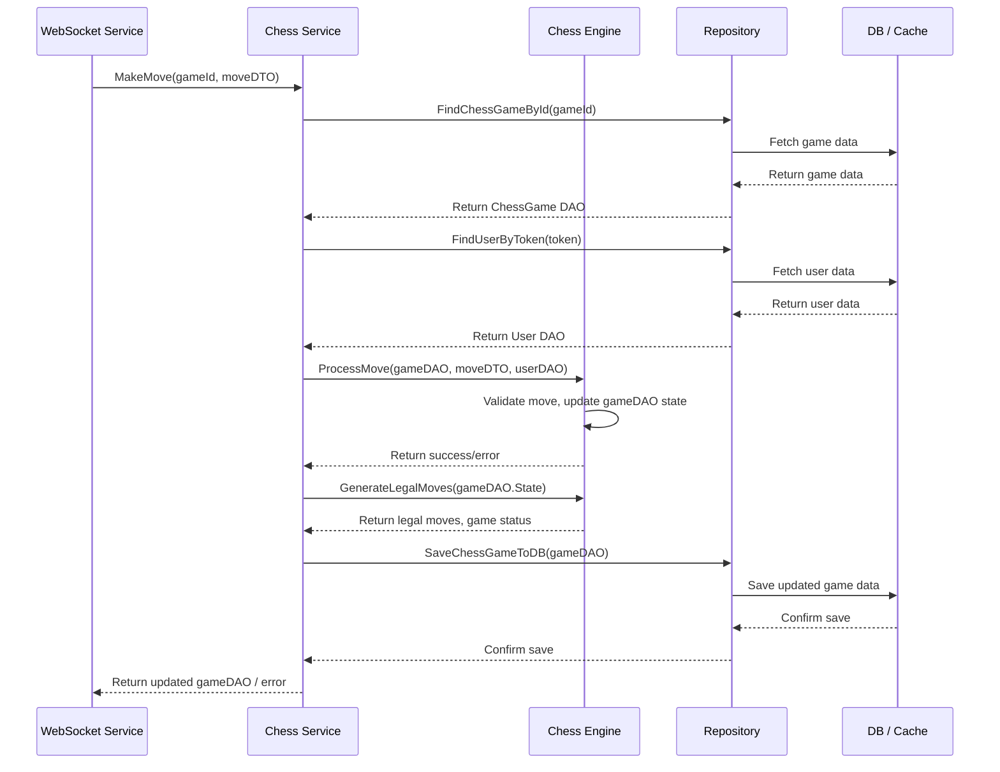

# Chapter 5: Service Layer - The Application's Brain

Welcome back! In [Chapter 4: Real-time Communication (WebSocket Service)](04_real_time_communication__websocket_service_.md), we saw how our server uses WebSockets to maintain an open "phone line" with each player's browser, allowing instant message sending (like making a move) and receiving (like seeing your opponent's move).

But when the WebSocket service receives a message like "Player 1 wants to move Pawn `e2` to `e4`", who actually figures out if that move is legal according to chess rules? Who updates the game board? Who decides if the game is over?

That's the job of the **Service Layer**!

## What Problem Does the Service Layer Solve?

Imagine our application is like a restaurant kitchen.
*   The [Controllers](03_api_routing___controllers.md) and [WebSocket Service](04_real_time_communication__websocket_service_.md) are like the waiters, taking orders (requests) from the customers (frontend).
*   The [Repositories](07_data_persistence__repositories_.md) are like the pantry clerks, fetching ingredients (data) from the storage (database).
*   The [Chess Engine](06_chess_engine__bitboard_implementation_.md) is like the rule book expert, knowing all the specific rules of chess.

But who actually *cooks* the meal? Who takes the order, gets the ingredients, consults the rule book, prepares the dish, and hands it back to the waiter? That's the **Head Chef** – the **Service Layer**.

The Service Layer contains the core **application logic** or **business rules**. It coordinates actions between the controllers/WebSocket service (waiters), the repositories (pantry clerks), and specialized components like the chess engine (rule book expert) to get the main job done correctly.

**Use Case:** Let's follow our familiar **making a move** example (`e2` to `e4`) after the WebSocket service receives the message:

1.  The WebSocket Service receives the `moveData` message (as seen in Chapter 4).
2.  It doesn't know chess rules! It passes this information to the **Chess Service** (part of the Service Layer).
3.  The Chess Service asks the **Chess Repository** ([Chapter 7](07_data_persistence__repositories_.md)) to "Please fetch the current state of this game from the database/cache."
4.  The Chess Service then asks the **Chess Engine** ([Chapter 6](06_chess_engine__bitboard_implementation_.md)) "Is moving a Pawn from `e2` to `e4` legal in this current game state?"
5.  If the Engine says "Yes", the Chess Service updates the game state in memory (Pawn is now on `e4`, it's Black's turn).
6.  It asks the Chess Repository to "Please save this new game state."
7.  It prepares the updated game information.
8.  It hands this updated information back to the WebSocket Service, saying "Okay, the move was successful. Here's the new state. Tell everyone involved."
9.  The WebSocket Service then broadcasts the update (as seen in Chapter 4).

The Service Layer orchestrated the entire process!

## Key Concepts: The Manager and the Rule Enforcer

1.  **Business Logic:** These are the specific rules and processes that define *what* the application does. For our chess game, this includes:
    *   Validating if a move is legal (according to piece movement, board state, whose turn it is).
    *   Updating the board position after a move.
    *   Changing whose turn it is.
    *   Detecting check, checkmate, or stalemate.
    *   Handling game creation, joining, and determining winners.
    *   *Basically, anything that requires knowledge of how chess works.*

2.  **Coordination:** Services act as managers or coordinators. They don't usually handle low-level details themselves (like direct database queries or raw WebSocket messages). Instead, they *delegate* tasks:
    *   Need data? Ask the **Repository**.
    *   Need to check a chess rule? Ask the **Chess Engine**.
    *   Received a request? Get it from the **Controller** or **WebSocket Service**.
    *   Need to send a response/update? Hand it back to the **Controller** or **WebSocket Service**.

3.  **Separation of Concerns:** Keeping the business logic in the Service Layer makes the application cleaner and easier to manage:
    *   **Controllers/WebSocket Service:** Focus only on receiving requests/messages and sending responses/broadcasts. They don't need to know *how* a move is validated.
    *   **Repositories:** Focus only on getting data in and out of the database/cache. They don't need to know *why* the data is being changed.
    *   **Chess Engine:** Focuses purely on the complex rules of chess calculation.
    *   **Services:** Connect everything together and enforce the application's flow.

## How It Works: Processing the Move Request

Let's see how the code reflects this coordination. Remember from Chapter 4, the `WebSocketService` received a message and called its own `ProcessMove` method. Inside *that* method, it relies on the `ChessService`.

**1. WebSocket Service Delegates to Chess Service**

The `WebSocketService` itself holds an instance of the `ChessService` and uses it to handle the core logic.

```go
// File: app/service/websocket_service.go (Simplified excerpt)

// ... WebSocketServiceImpl struct holds chessRepository ...

// ProcessMove handles an incoming move message via WebSocket
func (ws *WebSocketServiceImpl) ProcessMove(gameId string, message dto.WebSocketMessage) {
    log.Info("Processing move via WebSocket", message.Payload)

    // 1. Get Game State (using repository)
    game, err := ws.chessRepository.GetChessGameFromCache(gameId)
    // ... handle cache miss, fetch from DB if needed ...
    if err != nil { /* handle error */ }

    // 2. Extract Move Data (from message payload using DTO)
    var move dto.Move
    // ... code to get move details from message.Payload ...

    // 3. Get User Info (using repository)
    user, err := ws.chessRepository.FindUserByToken(move.Token)
    if err != nil { /* handle error */ }

    // 4. *** Core Logic: Call the Chess Engine ***
    //    This is where the main work happens!
    var gameStatus string
    var legalMoves map[uint64]uint64
    if lastMove, moveErr := engine.ProcessMove(&game, move, user); moveErr != nil {
        // Handle illegal move error
        status = "error"
        // ... set error message ...
    } else {
        // Move was legal! Update state in memory (engine did this)
        status = "success"

        // 5. Check for checkmate/stalemate (using Engine)
        legalMoves, gameStatus = engine.GenerateLegalMovesForAllPositions(game.State)
        // ... update game winner if checkmate ...

        // 6. Save the move history (using repository)
        // ... save gameMove = dao.GameMove{...} ...

        // 7. Save Updated Game State (using repository)
        _ = ws.chessRepository.SaveChessGameToCache(&game)
        _ = ws.chessRepository.SaveChessGameToDB(&game)
        // ... save game.State ...
    }

    // 8. Prepare Response Payload (using DTOs/DAOs)
    game.BoardLayout = engine.GetBoardLayout() // Get display info from engine
    game.CurrentState = engine.ConvertGameStateToMap(game.State) // Format state
    game.LegalMoves = engine.ConvertLegalMovesToMap(legalMoves) // Format moves

    // 9. Broadcast Result (via WebSocketService's own method)
    response := dto.WebSocketMessage{ /* ... */ Payload: game}
    ws.BroadcastMessage(gameId, response)
}
```
*Wait, the code above seems to be doing the logic directly inside the WebSocket Service!* That's a slight simplification in the provided context code. Ideally, steps 4-7 should be encapsulated within a `ChessService`. Let's imagine a refactored version where `WebSocketService.ProcessMove` calls `ChessService.MakeMove`.

**Refactored Approach (Conceptual):**

*   `WebSocketService.ProcessMove` would:
    *   Get the `gameId` and `move` DTO from the message.
    *   Call `chessService.MakeMove(gameId, move)`
    *   Receive the updated `game` object (or an error) back from `chessService`.
    *   Prepare the `WebSocketMessage` payload using the returned `game` data.
    *   Call `ws.BroadcastMessage`.

*   `ChessService.MakeMove` would contain the core logic (Steps 3-7 from the code above):
    *   Fetch the game state (`chessRepository`).
    *   Fetch the user (`chessRepository`).
    *   Call the `engine.ProcessMove` function ([Chapter 6](06_chess_engine__bitboard_implementation_.md)).
    *   Call `engine.GenerateLegalMoves...`.
    *   Save move history (`chessRepository`).
    *   Save updated game state (`chessRepository`).
    *   Return the updated `game` object.

Let's look at what the `ChessService` interface and a simplified `MakeMove` method *could* look like if structured this way:

```go
// File: app/service/chess_service.go (Interface Definition)

package service

import (
	"chess-engine/app/domain/dao"
	"chess-engine/app/domain/dto"
	"github.com/gin-gonic/gin" // Used for HTTP context, not WS here
)

// ChessService defines the operations related to chess game logic.
type ChessService interface {
	// For HTTP API requests (from Chapter 3)
	GetChessGameById(c *gin.Context)
	CreateChessGame(c *gin.Context)
	// ... other HTTP methods ...

	// For WebSocket move processing (called by WebSocketService)
	MakeMove(gameId string, move dto.Move) (*dao.ChessGame, error) // Returns updated game or error
}
```
This interface defines what the `ChessService` can do.

```go
// File: app/service/chess_service.go (Simplified MakeMove Implementation)

import (
	"chess-engine/app/domain/dao"
	"chess-engine/app/domain/dto"
	"chess-engine/app/engine" // The Chess Engine!
	"chess-engine/app/repository" // The Repository!
	log "github.com/sirupsen/logrus"
	"errors" // For creating error messages
)

type ChessServiceImpl struct {
	chessRepository repository.ChessRepository // Needs repository access
}

// MakeMove applies a move, updates state, and saves it.
func (svc ChessServiceImpl) MakeMove(gameId string, move dto.Move) (*dao.ChessGame, error) {
	log.Info("ChessService processing move for game:", gameId)

	// 1. Fetch Game State (using Repository)
	game, err := svc.chessRepository.FindChessGameById(gameId) // Simplified: ignores cache
	if err != nil {
		log.Error("Error fetching game:", err)
		return nil, errors.New("game not found")
	}

	// 2. Fetch User (using Repository)
	user, err := svc.chessRepository.FindUserByToken(move.Token)
	if err != nil { /* handle error */ }

	// 3. Apply move using Engine (the core chess logic)
	if _, moveErr := engine.ProcessMove(&game, move, user); moveErr != nil {
		log.Error("Invalid move:", moveErr)
		return nil, moveErr // Return the error from the engine
	}

	// 4. Check game status (e.g., checkmate - using Engine)
	_, gameStatus := engine.GenerateLegalMovesForAllPositions(game.State)
    // ... update game winner based on gameStatus ...

	// 5. Save updated state (using Repository)
	if err := svc.chessRepository.SaveChessGameToDB(&game); err != nil {
        // ... handle save error ...
		return nil, errors.New("failed to save game state")
    }
    // ... maybe update cache too ...

	log.Info("Move successful for game:", gameId)
	// 6. Return the updated game object
	return &game, nil
}

// Constructor for ChessService
func ChessServiceInit(repo repository.ChessRepository) *ChessServiceImpl {
	return &ChessServiceImpl{chessRepository: repo}
}
```
This simplified `MakeMove` function shows the orchestration:
1.  Gets data using the `chessRepository`.
2.  Uses the `engine` to perform the complex chess logic (`ProcessMove`, `GenerateLegalMoves...`).
3.  Saves the result using the `chessRepository`.
4.  Returns the updated game state (or an error) to whoever called it (likely the `WebSocketService`).

## Under the Hood: The Coordination Flow

Let's visualize the flow when a move comes through the WebSocket:



1.  **WebSocket Service** receives the move and calls `ChessService.MakeMove`.
2.  **Chess Service** asks the **Repository** for the current game state and user data.
3.  **Repository** gets the data from the **DB/Cache**.
4.  **Chess Service** passes the game state, move details, and user info to the **Chess Engine** to validate and apply the move (`ProcessMove`).
5.  The **Engine** does the complex rule check and updates the game state object *in memory*. It returns success or failure.
6.  **Chess Service** asks the **Engine** for the consequences (legal moves for the next player, checkmate/stalemate status).
7.  **Chess Service** tells the **Repository** to save the updated game state.
8.  **Repository** saves the data to the **DB/Cache**.
9.  **Chess Service** returns the final updated game object (or an error) back to the **WebSocket Service**.
10. (Not shown in diagram) The **WebSocket Service** then takes this result and broadcasts it.

The **Chess Service** is the central coordinator in this flow.

## Conclusion

The Service Layer is the "brain" of our application. It sits between the entry points (Controllers, WebSocket Service) and the data storage (Repositories), orchestrating the application's core **business logic**.

*   It receives tasks from controllers/WebSocket service.
*   It uses **Repositories** to fetch and save data.
*   It uses specialized components like the **Chess Engine** to perform complex calculations or rule checks.
*   It ensures the application follows the correct procedures (like validating a move before saving it).

By keeping this logic separate, our code becomes more organized, easier to test, and easier to understand. The `ChessService` specifically handles the rules and flow of the chess game itself.

Now that we understand *where* the chess logic is coordinated, let's dive into the "rule book expert" itself. In the next chapter, we'll explore the heart of the chess knowledge: [Chess Engine (Bitboard Implementation)](06_chess_engine__bitboard_implementation_.md).

---

Generated by [AI Codebase Knowledge Builder](https://github.com/The-Pocket/Tutorial-Codebase-Knowledge)