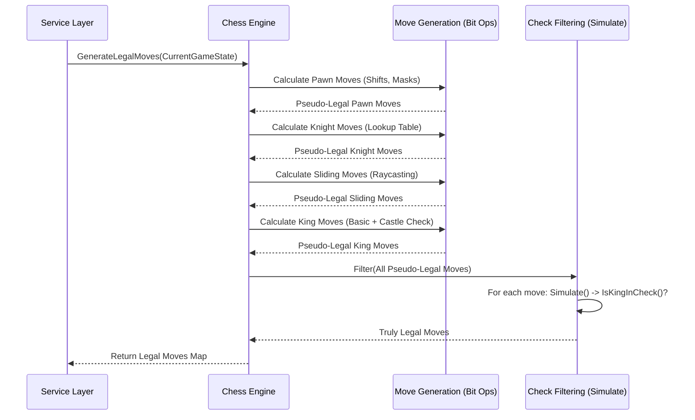

# Chapter 6: Chess Engine (Bitboard Implementation)

Welcome back! In [Chapter 5: Service Layer](05_service_layer.md), we saw how the `ChessService` acts as the application's brain, coordinating tasks like handling a move request. It received the move, asked the Repository for data, and then... well, it needed someone to actually *understand* the rules of chess. That's where the **Chess Engine** comes in!

This chapter explores the heart of our chess logic: the Engine, and specifically, how we implement it using a clever technique called **Bitboards**.

## What Problem Does the Chess Engine Solve?

Imagine you're building a robot that can play chess. You need to program its brain with all the rules:
*   How does a Knight move?
*   Can this Pawn move two squares forward?
*   Is the King currently under attack (in check)?
*   Is this move even legal, considering the current board state?
*   What are *all* the possible legal moves right now?

The **Chess Engine** is the part of our application that answers all these questions. It's the ultimate rulebook expert and calculator for the game. It takes the current state of the board and a proposed move, and tells the [Service Layer](05_service_layer.md) whether that move is valid according to the rules of chess. It can also calculate things like checkmate or list all possible moves.

**Use Case:** Let's stick with our favorite move: White moving a Pawn from `e2` to `e4` at the start of the game.
1.  The [Service Layer](05_service_layer.md) receives the request: "Move Pawn from `e2` to `e4`."
2.  It asks the **Chess Engine**: "Here's the board state. Is `e2` to `e4` a valid move for White right now?"
3.  The **Chess Engine** needs to check:
    *   Is there actually a White Pawn on `e2`?
    *   Is `e4` empty?
    *   Is moving a Pawn forward two squares valid from `e2`? (Yes, on its first move)
    *   Does this move put White's *own* King in check? (No)
4.  The Engine determines the move is valid and replies "Yes" to the Service Layer.

Without the Engine, the application wouldn't know how to play chess!

## Key Concepts: Rulebook + Super-Fast Calculator

1.  **Chess Engine:** The component responsible for:
    *   Knowing all the rules of chess (piece movement, castling, en passant, check, checkmate, stalemate).
    *   Validating if a proposed move is legal in a given position.
    *   Generating all possible legal moves for the current player.
    *   Updating the board state after a legal move is made.

2.  **Bitboards:** This is *how* our engine represents the chessboard internally. It's a very efficient method used in many high-performance chess engines.
    *   **Analogy:** Imagine a light switch panel with 64 switches, one for each square on the chessboard (a1, a2... h8).
    *   A **bitboard** is a single number (specifically, a 64-bit unsigned integer, `uint64` in Go) where each bit (0 or 1) corresponds to one of those switches (squares).
    *   If a bit is `1`, it means something is "true" for that square (e.g., "there is a piece here"). If it's `0`, it's "false".
    *   We use *multiple* bitboards to store the full picture:
        *   One bitboard shows where *all* White pieces are.
        *   One bitboard shows where *all* Black pieces are.
        *   One bitboard shows where *only* the Pawns are.
        *   One bitboard shows where *only* the Knights are.
        *   ...and so on for Rooks, Bishops, Queens, Kings.

    ```text
    // A simplified view of a single bitboard (e.g., Pawns)
    // (Imagine 64 bits, 0 or 1)
    Number: 0000000000000000...00001111111100000000...

    Board Representation:
    8 | 0 0 0 0 0 0 0 0
    7 | 0 0 0 0 0 0 0 0
    ...
    3 | 0 0 0 0 0 0 0 0
    2 | 1 1 1 1 1 1 1 1  <- White Pawns start here (bits are 1)
    1 | 0 0 0 0 0 0 0 0
      -----------------
        a b c d e f g h
    ```

3.  **Why Bitboards? SPEED!**
    *   Computers are *extremely* fast at doing math on numbers, especially bitwise operations (AND, OR, XOR, shifts).
    *   Instead of checking squares one by one ("Is there a piece on f3? Is there a piece on g4?"), we can use single math operations on our bitboards to answer complex questions instantly.
    *   Example: "Where can this Knight on `c3` move?" can be answered by taking the pre-calculated Knight moves bitboard (a lookup table!) and combining it with the bitboards for friendly and enemy pieces using just a couple of CPU instructions. This is much faster than looping through 8 possible squares individually.

## How It Works: Validating `e2e4` with Bitboards

Let's see how the Engine uses bitboards to check if White moving Pawn `e2` to `e4` is valid at the start.

**1. Representing the Board State:**

The [Service Layer](05_service_layer.md) provides the current game state to the Engine. This state includes multiple bitboards stored in our `GameState` DAO ([Chapter 2: Domain Objects (DAO/DTO)](02_domain_objects__dao_dto_.md)).

```go
// File: app/domain/dao/chess.go (Relevant GameState fields)

type GameState struct {
	// ... other fields ...
	WhiteBitboard  uint64 // All white pieces
	BlackBitboard  uint64 // All black pieces
	PawnBitboard   uint64 // All pawns (both colors)
	// ... bitboards for Rook, Knight, Bishop, Queen, King ...
	Turn           string // Whose turn ('w' or 'b')
}
```
At the start, `WhiteBitboard` would have bits set for squares a1-h1 and a2-h2. `PawnBitboard` would have bits set for a2-h2 and a7-h7. `Turn` would be "w".

**2. Representing the Move:**

The Engine needs to know which squares `e2` and `e4` correspond to in the 64-bit number. It uses a helper function.

```go
// File: app/engine/bitboard_utils.go (Simplified)

// PositionToIndex converts "e2" to an index (0-63).
// A common convention is a1=0, b1=1... h1=7, a2=8... e2=12... e4=28... h8=63
func PositionToIndex(position string) int {
	column := position[0] - 'a' // 'e' - 'a' = 4
	row := position[1] - '1'    // '2' - '1' = 1
	return int(row*8 + column) // 1*8 + 4 = 12 (for e2)
	// Similarly, "e4" becomes 3*8 + 4 = 28
}
```
So, the move is from bit index 12 to bit index 28. The engine represents these squares as bitboards themselves, with only that single bit set:
*   `sourceBit = uint64(1) << 12` (A number with only the 12th bit as 1)
*   `destinationBit = uint64(1) << 28` (A number with only the 28th bit as 1)

**3. Checking Basic Legality (Bitwise Magic):**

Now the engine uses bitwise operations (`&` for AND, `|` for OR, `^` for XOR, `<<` for left shift, `>>` for right shift) to check rules.

*   **Is there a White Pawn on `e2`?**
    ```go
    // Is the bit for e2 set in WhiteBitboard AND PawnBitboard?
    isWhitePawnOnSource := (gameState.WhiteBitboard & gameState.PawnBitboard & sourceBit) != 0
    // Result: true
    ```
*   **Is it White's turn?**
    ```go
    isWhiteTurn := gameState.Turn == "w"
    // Result: true
    ```
*   **Is the destination square `e4` empty?**
    ```go
    // Combine all white and black pieces to find occupied squares
    occupied := gameState.WhiteBitboard | gameState.BlackBitboard
    // Is the bit for e4 NOT set in the occupied board?
    isDestinationEmpty := (occupied & destinationBit) == 0
    // Result: true
    ```
*   **Is the single-step move (`e3`) also empty?** (Needed for a double move)
    ```go
    oneStepBit := sourceBit << 8 // Moving forward 1 rank is shifting left by 8 bits
    isOneStepEmpty := (occupied & oneStepBit) == 0
    // Result: true
    ```
*   **Is this a valid double pawn push?**
    ```go
    // Check if pawn is on its starting rank (rank 2 for white)
    isOnRank2 := (sourceBit & 0x000000000000FF00) != 0 // Rank 2 bitmask
    // Is the move exactly two steps forward?
    isTwoStepsForward := (destinationBit == sourceBit << 16)

    isValidDoublePush := isOnRank2 && isTwoStepsForward && isOneStepEmpty && isDestinationEmpty
    // Result: true
    ```

These checks use fast, low-level bit operations. This code is part of the move generation logic.

```go
// File: app/engine/bitboard_legal_moves.go (Simplified Pawn Move Logic)

// Inside generatePawnMoves function for white pawns...
piece := sourceBit // The bit representing the pawn at e2

// Single forward move (e3)
singleMove := piece << 8
if singleMove & ^occupied != 0 { // Check if e3 is NOT occupied
    // legal_moves[piece] |= singleMove // Mark e3 as possible
}

// Double forward move (e4)
doubleMove := piece << 16
if (piece & 0x000000000000FF00) != 0 && // Is on rank 2?
   (singleMove & ^occupied != 0) && // Is e3 empty?
   (doubleMove & ^occupied != 0) { // Is e4 empty?
	// legal_moves[piece] |= doubleMove // Mark e4 as possible
}
```
This snippet generates *potential* moves. `^occupied` creates a bitboard of empty squares.

**4. Checking Complex Rules (Pins, Checks):**

Just because a Pawn *can* move to `e4` doesn't mean it's *legal*. What if moving the pawn would expose the White King on `e1` to an attack from a Black piece on `a5`? That would be an illegal move.

The engine handles this by:
a.  Generating all *pseudo-legal* moves (like the pawn moves above, ignoring checks).
b.  For each pseudo-legal move:
    i.  **Simulate** the move on a temporary copy of the bitboards (move the pawn from `e2` to `e4`).
    ii. **Check** if the player's *own* King is under attack in this *simulated* position. This involves calculating all opponent attack patterns using bitboards.
    iii. If the King is *not* under attack, the move is truly legal.

```go
// File: app/engine/bitboard_legal_moves.go (Conceptual Check Filtering)

func filterLegalMoves(...) map[uint64]uint64 {
    filteredMoves := make(map[uint64]uint64)
    // For each piece and its pseudo-legal moves...
    for piece, moves := range pseudoLegalMoves {
        // For each target square for that piece...
        for move := moves; move != 0; move &= move - 1 {
            targetSquareBit := move & -move // Get the single bit for target

            // Create a temporary board state with the move made
            simulatedGameState := simulateMove(originalGameState, piece, targetSquareBit)

            // Check if the current player's king is safe in the new state
            isWhite := (originalGameState.WhiteBitboard & piece) != 0
            if !isKingInCheck(simulatedGameState, isWhite) {
                // If king is safe, add this move to the truly legal moves
                filteredMoves[piece] |= targetSquareBit
            }
        }
    }
    return filteredMoves
}
```
This filtering ensures moves don't leave the King in check. `isKingInCheck` itself uses bitboards to see if any opponent piece's attack pattern overlaps the King's square.

**5. Updating the Board (If Legal):**

If the engine confirms `e2e4` is legal, the [Service Layer](05_service_layer.md) will ask the engine (via a function like `ProcessMove`) to update the actual game state bitboards.

```go
// File: app/engine/bitboard_moves.go (Simplified Update Logic)

// Assume sourceIdx=12 (e2), destinationIdx=28 (e4)
sourceBit := uint64(1) << sourceIdx
destinationBit := uint64(1) << destinationIdx

// Update White's pieces: Remove from e2, Add to e4
// (XOR is often used: A ^ B toggles bits)
game.State.WhiteBitboard ^= (sourceBit | destinationBit)

// Update Pawn pieces: Remove from e2, Add to e4
game.State.PawnBitboard ^= (sourceBit | destinationBit)

// Update whose turn it is
game.State.Turn = "b" // Switch turn to Black

// Update last move, castling rights, en passant etc.
// ...
```
This uses bitwise XOR (`^`) to efficiently flip the bits for the source and destination squares in the relevant bitboards.

## Under the Hood: The Engine's Calculation Flow

Let's trace how the engine determines all legal moves for White at the start.

1.  **Input:** The current `GameState` (initial position, White's turn).
2.  **Generate Pseudo-Legal Moves:**
    *   Calculate all possible Pawn moves (single, double, captures) using bit shifts and masks.
    *   Calculate Knight moves using a pre-computed lookup table (`KnightAttackBitboard`).
    *   Calculate sliding piece (Rook, Bishop, Queen) moves by "shooting rays" on the bitboard until they hit another piece or the edge.
    *   Calculate King moves (including castling, checking legality based on attacked squares).
3.  **Filter for Checks:**
    *   For each pseudo-legal move found above:
        *   Simulate the move on temporary bitboards.
        *   Check if White's King is attacked in the simulated position by any Black piece.
        *   If the King is safe, keep the move; otherwise, discard it.
4.  **Output:** A data structure (like a map) where keys are the bit representation of piece starting squares, and values are bitboards representing all legal destination squares for that piece.



## Pre-Calculation: The Magic Tables

For pieces like Knights and Kings whose moves don't depend on other pieces blocking them (they jump), we can pre-calculate all possible destination squares from every source square and store them in a lookup table.

```go
// File: app/engine/bitboard_magic.go (Excerpt)

// Pre-calculated attack patterns for Knights from each square
var KnightAttackBitboard = map[uint64]uint64{
    // Example: Knight on c3 (index 18, bit = 1 << 18)
    // Value is a bitboard with bits set for squares:
    // a2, b1, d1, e2, e4, d5, b5, a4
	0x40000:            0xa1100110a, // Knight at c3 -> moves bitboard
	// ... entries for all 64 squares ...
}

// To find Knight moves from c3:
// 1. Get the bit for c3: pieceBit = uint64(1) << 18
// 2. Look up in the table: pseudoMoves = KnightAttackBitboard[pieceBit]
// 3. Remove moves landing on friendly pieces:
//    legalMoves = pseudoMoves & ^gameState.WhiteBitboard
```
Using these tables (`KnightAttackBitboard`, `KingAttackBitboard`, etc.) is much faster than calculating the moves from scratch every time.

## Conclusion

The Chess Engine, implemented using **Bitboards**, is the core logic unit that understands and applies the rules of chess. Bitboards provide a highly efficient way to represent the board state using 64-bit numbers, allowing complex calculations like move generation, validation, and check detection to be performed rapidly using bitwise operations and pre-computed tables.

While the concepts might seem complex initially, this approach is key to building a fast and responsive chess application. The engine takes the board state, validates moves, determines game status, and updates the state, forming the foundation upon which the rest of the application builds the user experience.

Now that we have this potentially complex game state managed by the engine, how do we save it reliably so players can resume their games later? That's the topic of our next chapter: [Chapter 7: Data Persistence (Repositories)](07_data_persistence__repositories_.md).

---

