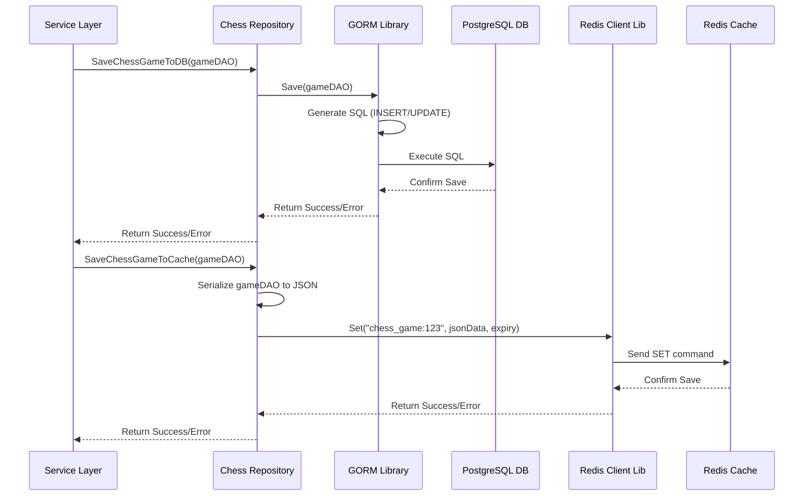

# Chapter 7: Data Persistence (Repositories)

Welcome back! In [Chapter 6: Chess Engine (Bitboard Implementation)](06_chess_engine__bitboard_implementation_.md), we explored the complex heart of our chess logic – the engine that understands the rules and uses efficient bitboards to manage the game state. The engine updates the board representation after a move like `e2e4`.

But what happens if the server restarts or the player closes their browser and comes back later? We need to *save* the game's progress! This is where **Data Persistence** comes in, and the **Repository Layer** is how we manage it cleanly.

## What Problem Does This Solve?

Imagine you've just played a brilliant move in your online chess game. The board updates, and it's your opponent's turn. Now, imagine the server crashes for a second. If the game state wasn't saved anywhere, it would be lost forever! You'd have to start over. That's frustrating!

**Data Persistence** solves this by storing important information (like user profiles, game details, and the current board state) in a place where it won't disappear when the application stops running.

The **Repository Layer** acts like our application's dedicated librarian or filing clerk. It provides a simple, organized way for other parts of the application (like the [Service Layer](05_service_layer.md)) to ask for data ("Get me Game #123") or store data ("Save this updated state for Game #123") without needing to know the messy details of *how* or *where* it's actually stored.

**Use Case:** Let's follow our `e2e4` move again.
1.  The [Service Layer](05_service_layer.md) validated the move `e2e4` using the [Chess Engine](06_chess_engine__bitboard_implementation_.md).
2.  The Engine updated the game state in memory (Pawn is on `e4`, it's Black's turn, bitboards are updated).
3.  Now, the Service Layer needs to make sure this new state is saved permanently.
4.  It calls a function in the **Chess Repository**, something like `SaveChessGame(updatedGameState)`.
5.  The Repository takes the `updatedGameState` data and handles the details of writing it to our storage systems (the database and maybe a cache).
6.  Later, if the game needs to be loaded, the Service Layer asks the Repository `GetChessGame(gameId)`, and the Repository retrieves the saved state.

## Key Concepts: The Filing System

1.  **Persistence:** The act of making data last, typically by saving it to disk in a database or file.
2.  **Database (PostgreSQL):** Our primary, long-term storage. Think of it as the main, heavy-duty filing cabinet. It's reliable and keeps data safe even if the power goes out. We use PostgreSQL, a popular and powerful relational database. Data here is the "source of truth".
3.  **Cache (Redis):** A secondary, temporary, but very *fast* storage. Think of it like a small set of drawers right next to your desk for frequently used files. Redis is an in-memory data store, meaning it keeps data in the computer's RAM for quick access. It's great for speeding things up, but data *can* be lost if the cache restarts (so it shouldn't be the only place important data is stored).
4.  **Repository:** A programming pattern. It's a Go `interface` and `struct` in our code that defines *what* data operations are possible (like `FindGameByID`, `SaveGame`), hiding the *how* (SQL queries, Redis commands). It acts as an intermediary between the application logic (Services) and the storage systems (Database, Cache).

**Analogy:** The Service Layer is like an office worker who needs a file. They ask the Repository (the librarian) for "File X". The librarian knows whether File X is usually kept in the fast-access desk drawer (Redis Cache) or if they need to go to the main archive room (PostgreSQL Database). The office worker doesn't need to know the filing system details, just that they ask the librarian and get the file.

## How It Solves the Use Case: Saving the Game

After the `e2e4` move is made and the [Service Layer](05_service_layer.md) has the updated `ChessGame` object (which includes the `GameState` with updated bitboards - see [Domain Objects (DAO/DTO)](02_domain_objects__dao_dto_.md)), it needs to save it.

It simply calls methods provided by the `ChessRepository`.

```go
// Conceptual code within the Service Layer (e.g., ChessService.MakeMove)

// 'updatedGame' is a dao.ChessGame object with the new state after e2e4
// 'svc.chessRepository' is our instance of the ChessRepository

// Save to the primary storage (Database)
errDb := svc.chessRepository.SaveChessGameToDB(&updatedGame)
if errDb != nil {
    log.Error("Failed to save game to database:", errDb)
    // Handle error appropriately
}

// Also save to the fast-access storage (Cache) for quick retrieval
errCache := svc.chessRepository.SaveChessGameToCache(&updatedGame)
if errCache != nil {
    log.Warn("Failed to save game to cache:", errCache)
    // Log warning, but maybe don't fail the whole operation
    // as the DB save is the critical one.
}
```

Look how simple it is from the Service Layer's perspective! It just calls `SaveChessGameToDB` and `SaveChessGameToCache`, passing the data object (`updatedGame`). It doesn't need to write SQL code or Redis commands. That complexity is hidden inside the Repository.

## Under the Hood: How the Repository Works

What happens inside the Repository when the Service Layer calls those methods?

**1. Calling `SaveChessGameToDB`:**

*   **Input:** The `ChessGame` DAO object containing all game info, including the nested `GameState` with bitboards.
*   **Repository:** Takes the `ChessGame` object.
*   **GORM:** The Repository uses a library called GORM (Go Object-Relational Mapper). GORM is smart enough to look at the Go `struct` (`ChessGame`, `GameState`) and automatically figure out how to save it to the corresponding tables in our PostgreSQL database. It generates the necessary SQL `INSERT` or `UPDATE` commands.
    *   It might save the main `ChessGame` details first.
    *   Then it saves the associated `GameState` (including the large `uint64` bitboard numbers).
*   **Database:** PostgreSQL receives the SQL commands from GORM and stores the data permanently in the `chess_games` and `game_states` tables.

**2. Calling `SaveChessGameToCache`:**

*   **Input:** The `ChessGame` DAO object.
*   **Repository:** Takes the `ChessGame` object.
*   **Serialization:** It needs to convert the complex Go `struct` into a format Redis can store (Redis usually stores simple strings or data structures). A common way is to convert the Go object into JSON (a text format).
*   **Redis Client:** The Repository uses a Redis client library (`go-redis`). It tells the client: "Store this JSON string under the key `chess_game:123` (where 123 is the game ID) and make it expire after, say, 1 hour."
*   **Redis Server:** Redis receives the command and stores the JSON string in its fast in-memory storage with the specified key and expiration time.

**Diagram:**



This diagram shows the Repository acting as the middleman, translating the Service Layer's simple request into specific database or cache operations using helper libraries (GORM, Redis Client).

## Deeper Dive into Repository Code

Let's look at simplified snippets from our actual `ChessRepository`.

**Repository Interface:** Defines *what* the repository can do.

```go
// File: app/repository/chess_repository.go

// Interface defining operations for chess data
type ChessRepository interface {
	FindChessGameById(id string) (dao.ChessGame, error)
	GetChessGameFromCache(gameId string) (dao.ChessGame, error)
	SaveChessGameToDB(game *dao.ChessGame) error
	SaveGameStateToDB(game *dao.GameState) error // Saves only the state part
	SaveChessGameToCache(game *dao.ChessGame) error
	// ... other methods like FindUserByToken, SaveGameMove ...
}
```
This interface guarantees that any implementation of `ChessRepository` will have these methods, making it easy for the Service Layer to use.

**Repository Implementation:** Contains the actual logic using GORM and Redis.

```go
// File: app/repository/chess_repository.go

import (
	"chess-engine/app/domain/dao" // DAOs are used here
	"chess-engine/app/pkg"      // Redis client package
	"encoding/json"             // To convert Go objects to JSON
	"fmt"
	"time"
	log "github.com/sirupsen/logrus"
	"gorm.io/gorm"              // GORM library
)

// Implementation holds database connection and Redis client
type ChessRepositoryImpl struct {
	db          *gorm.DB        // GORM database handle
	redisClient *pkg.RedisClient // Our Redis client wrapper
}

// Constructor to create a repository instance
func ChessRepositoryInit(db *gorm.DB, redisClient *pkg.RedisClient) *ChessRepositoryImpl {
	// ... (AutoMigrate ensures tables exist) ...
	return &ChessRepositoryImpl{
		db:          db,
		redisClient: redisClient,
	}
}
```
The implementation `ChessRepositoryImpl` holds the necessary tools: the database connection (`db`) and the Redis client (`redisClient`).

**Saving to Database:**

```go
// File: app/repository/chess_repository.go

// Save the entire chess game object to the database
func (r ChessRepositoryImpl) SaveChessGameToDB(game *dao.ChessGame) error {
	// GORM's Save handles both creating new records (INSERT)
	// and updating existing ones (UPDATE) based on the ID.
	// It automatically saves associated structs like 'State' if configured.
	if err := r.db.Save(game).Error; err != nil {
		log.Error("Error saving chess game to DB:", err)
		return err
	}
	log.Infof("Saved game %d to DB", game.ID)
	return nil
}
```
This uses `r.db.Save(game)`. GORM does the heavy lifting of converting the `game` object (including its nested `State`) into SQL and executing it against the PostgreSQL database.

**Saving to Cache:**

```go
// File: app/repository/chess_repository.go

// Save the chess game state to the cache (Redis)
func (r ChessRepositoryImpl) SaveChessGameToCache(game *dao.ChessGame) error {
	// Convert the Go object into JSON format
	gameJSON, err := json.Marshal(game)
	if err != nil {
		log.Error("Error marshalling game for Redis:", err)
		return err // Cannot proceed if conversion fails
	}

	// Construct the key for Redis (e.g., "chess_game:123")
	redisKey := "chess_game:" + fmt.Sprint(game.ID)
	// Set expiration time (e.g., 100 minutes)
	expiration := time.Minute * 100

	// Use our Redis client to store the JSON string
	err = r.redisClient.Set(redisKey, gameJSON, expiration)
	if err != nil {
		log.Error("Error saving game to Redis:", err)
		// Return error, but maybe the caller treats it differently
	} else {
		log.Infof("Saved game %d to Cache (Redis)", game.ID)
	}
	return err
}
```
This function first converts the `game` object to JSON using `json.Marshal`. Then, it uses our `redisClient` (from `app/pkg/redis_client.go`) to execute a `SET` command in Redis, storing the JSON data under a specific key (`redisKey`) with an expiration time.

**Retrieving Data (Example):**

Getting data back is the reverse process. The Repository provides methods like `FindChessGameById` (which uses `r.db.First(&chess, id)`) to query the database via GORM, and `GetChessGameFromCache` (which uses `r.redisClient.Get(key)`) to fetch from Redis and then uses `json.Unmarshal` to convert the JSON back into a `dao.ChessGame` object. The Service Layer might try the cache first for speed, and if it's not found there (a "cache miss"), it asks the repository to fetch it from the database.

## Conclusion

The Data Persistence layer, implemented using the **Repository pattern**, is crucial for saving and retrieving our application's data (like game states and user info).

*   Repositories provide a clean interface ([`ChessRepository`](app/repository/chess_repository.go)) for the [Service Layer](05_service_layer.md) to interact with data storage.
*   They hide the complexities of talking to the **PostgreSQL Database** (using **GORM**) and the **Redis Cache** (using a Redis client library).
*   This separation keeps the Service Layer focused on business logic and makes the application easier to maintain and test.
*   We use the Database for permanent, reliable storage (the source of truth) and the Cache for fast, temporary storage to improve performance.

We've now seen almost all the major pieces of our chess application! But how do all these components (Controllers, Services, Repositories, Engine) get created and connected? How does the `ChessService` get the correct `ChessRepository` instance to use? That's the role of Dependency Injection and Configuration.

Let's explore how everything gets wired together in the final chapter: [Dependency Injection & Configuration](08_dependency_injection___configuration.md).

---

