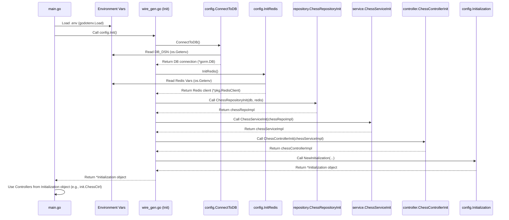

# Chapter 8: Dependency Injection & Configuration

Welcome to the final chapter! In [Chapter 7: Data Persistence (Repositories)](07_data_persistence__repositories_.md), we saw how the Repository layer neatly handles saving and loading our chess game data using the database (PostgreSQL) and cache (Redis). We saw the [Service Layer](05_service_layer.md) simply calling methods like `chessRepository.SaveChessGameToDB(...)`.

But wait... how did the `ChessService` *get* the `ChessRepository` instance in the first place? And how did the `ChessRepository` know the correct database password or Redis address to connect to? Manually creating and connecting all these pieces would be like building a huge Lego model without instructions – messy and easy to get wrong!

This chapter explores **Dependency Injection & Configuration**, the system that acts like our application's "assembly line supervisor", automatically building and connecting all the components based on a set of instructions (configuration) when the application starts.

## What Problem Does This Solve?

Imagine our chess application is made of different building blocks:
*   A `ChessController` to handle web requests ([Chapter 3: API Routing & Controllers](03_api_routing___controllers.md)).
*   A `ChessService` to manage the game logic ([Chapter 5: Service Layer](05_service_layer.md)).
*   A `ChessRepository` to talk to the database ([Chapter 7: Data Persistence (Repositories)](07_data_persistence__repositories_.md)).
*   A `WebSocketController` and `WebSocketService` for real-time updates ([Chapter 4: Real-time Communication (WebSocket Service)](04_real_time_communication__websocket_service_.md)).
*   Connections to external things like the Database and Redis.

These blocks need each other to work:
*   The `ChessController` needs the `ChessService`.
*   The `ChessService` needs the `ChessRepository`.
*   The `ChessRepository` needs the Database connection details and the Redis client.
*   The `WebSocketService` also needs the `ChessRepository`.

How do we ensure every block gets the *exact* other blocks it needs, configured correctly?

**Dependency Injection (DI)** and **Configuration** solve this by:
1.  **Configuration:** Reading settings (like database passwords, server port numbers) from a central place.
2.  **Dependency Injection:** Automatically creating and "injecting" (providing) the required components (dependencies) into the components that need them.

**Use Case:** Let's trace how the application starts and ensures the `ChessController` is ready to handle requests:

1.  The application starts (`main.go` runs).
2.  It needs to read configuration settings (e.g., the database connection string `DB_DSN` from environment variables, maybe defined in `docker-compose.yaml` or a `.env` file).
3.  It needs to create a Database connection using that string.
4.  It needs to create a Redis client connection.
5.  It needs to create a `ChessRepository`, giving it the Database and Redis connections.
6.  It needs to create a `ChessService`, giving it the `ChessRepository`.
7.  It needs to create a `ChessController`, giving it the `ChessService`.
8.  Finally, it needs to tell the web router ([Chapter 3](03_api_routing___controllers.md)) to use this fully assembled `ChessController` for chess-related API requests.

DI & Configuration automates steps 2 through 8.

## Key Concepts: The Assembly Line

1.  **Configuration:**
    *   **What it is:** The set of external settings your application needs to run, like database addresses, passwords, port numbers, log levels, etc.
    *   **Where it comes from:** Often from **Environment Variables**. These are variables set *outside* your application code, making it easy to change settings for different environments (development, testing, production) without changing the code itself. Tools like Docker (`docker-compose.yaml`) or `.env` files help manage these.
    *   **Analogy:** The instruction sheet for your Lego model, telling you which specific pieces (like database type 'PostgreSQL' or port '9000') to use.

2.  **Dependency:**
    *   **What it is:** When one piece of code (e.g., `ChessService`) needs another piece of code (e.g., `ChessRepository`) to do its job. The `ChessService` *depends* on the `ChessRepository`.
    *   **Analogy:** The car engine *depends* on the battery to start.

3.  **Dependency Injection (DI):**
    *   **What it is:** The *process* of giving a component its dependencies from the outside, instead of having the component create them itself.
    *   **Example:** Instead of the `ChessService` writing code like `myRepo := repository.NewChessRepository(...)` inside itself, something *external* creates the `ChessRepository` and passes it *into* the `ChessService` when the `ChessService` is created.
    *   **Analogy:** On an assembly line, a worker doesn't make their own tools. The supervisor *injects* the correct tool (dependency) into their workstation when they need it.

4.  **Wire (The DI Tool / Assembly Supervisor):**
    *   **What it is:** A tool for Go (specifically, `github.com/google/wire`) that automates Dependency Injection.
    *   **How it works:**
        *   You write simple "wiring instructions" in specific Go files (like `config/injector.go`) telling Wire *how* to create each component and what its dependencies are (e.g., "To make a `ChessService`, you first need a `ChessRepository`").
        *   You run the `wire` command.
        *   Wire reads your instructions and automatically generates the necessary Go code (in `config/wire_gen.go`) that performs all the steps of creating and connecting components in the correct order.
    *   **Analogy:** The assembly line supervisor (Wire) reads the master blueprint (`injector.go`) and sets up the entire assembly line (`wire_gen.go`) so everything flows correctly.

## How It Solves the Use Case: Assembling the Application

Let's see how these concepts work together when our `chess` application starts.

**1. Starting Point (`main.go`)**

The application execution begins here. It loads configuration and then calls a function to initialize everything.

```go
// File: main.go (Simplified)
package main

import (
	"chess-engine/app/router"
	"chess-engine/config" // Our configuration/DI package
	"os"
	"github.com/joho/godotenv" // Library to load .env files
)

func init() {
	godotenv.Load() // Load environment variables from .env file (if any)
	config.InitLog() // Setup logging based on config
}

func main() {
	port := os.Getenv("PORT") // Read PORT from environment variable

	// *** This is the key step! ***
	// Call the function that Wire helps generate.
	// It creates and connects everything.
	init := config.Init()

	// Setup the web router using the initialized controllers
	app := router.Init(init)

	// Start the web server
	app.Run(":" + port)
}
```
This code first loads environment variables (using `godotenv`) which might define `DB_DSN`, `REDIS_ADDR`, etc. Then, it calls `config.Init()`. This function, generated by Wire, does all the magic of creating and connecting our components.

**2. Reading Configuration (`config/database.go`, `config/redis.go`)**

Early in the initialization process, functions are called to get configuration values and create initial connections.

```go
// File: config/database.go (Simplified)
package config

import (
	"gorm.io/driver/postgres"
	"gorm.io/gorm"
	"log"
	"os" // Package to read environment variables
)

func ConnectToDB() *gorm.DB {
	// Read the database connection string from environment variable "DB_DSN"
	dsn := os.Getenv("DB_DSN")
	if dsn == "" {
		log.Fatal("DB_DSN environment variable not set")
	}

	// Use GORM to open the database connection
	db, err := gorm.Open(postgres.Open(dsn), &gorm.Config{})
	// ... error handling ...
	log.Println("Database connection successful!")
	return db // Return the database connection object
}

```
`ConnectToDB` uses `os.Getenv("DB_DSN")` to read the database connection details provided externally. Similarly, `config/redis.go` reads Redis connection details. These functions provide the initial dependencies (DB and Redis connections).

**3. Wiring Instructions (`config/injector.go`)**

This file *doesn't* contain the actual creation logic. It contains instructions *for the Wire tool*.

```go
// File: config/injector.go (Simplified Instructions for Wire)
//go:build wireinject
// +build wireinject

package config

// ... imports for controller, repository, service ...
import "github.com/google/wire" // Import Wire library

// Define 'sets' of related providers. Wire uses these.
var db = wire.NewSet(ConnectToDB) // Tells Wire: use ConnectToDB to get *gorm.DB
var redis = wire.NewSet(InitRedis) // Tells Wire: use InitRedis to get *pkg.RedisClient

// Tells Wire how to provide a ChessRepository
var chessRepoSet = wire.NewSet(
	repository.ChessRepositoryInit, // Use this constructor function
	// Tell Wire that whenever something needs a 'repository.ChessRepository' (interface),
	// provide an instance of '*repository.ChessRepositoryImpl' (concrete type).
	wire.Bind(new(repository.UserRepository), new(*repository.UserRepositoryImpl)),
)

// Tells Wire how to provide a ChessService
var chessSvcSet = wire.NewSet(
	service.ChessServiceInit, // Use this constructor function
	wire.Bind(new(service.ChessService), new(*service.ChessServiceImpl)),
)

// Tells Wire how to provide a ChessController
var chessCtrlSet = wire.NewSet(
	controller.ChessControllerInit, // Use this constructor function
	wire.Bind(new(controller.ChessController), new(*controller.ChessControllerImpl)),
)

// The main function Wire analyzes.
// Tells Wire: "To initialize the application, build these components."
func Init() *Initialization {
	// Wire figures out the order based on dependencies defined in the sets.
	wire.Build(
		NewInitialization, // Function to package everything at the end
		db,             // Need the DB connection
		redis,          // Need the Redis connection
		chessRepoSet,   // Need the repository
		chessSvcSet,    // Need the service
		chessCtrlSet,   // Need the controller
		// ... include other sets like user, socket, role ...
	)
	return nil // This return is ignored, Wire generates the real body
}

```
This file uses `wire.NewSet` to tell Wire about "provider" functions (like `ConnectToDB`, `repository.ChessRepositoryInit`). `wire.Bind` links interfaces to their concrete implementations. `wire.Build` lists all the pieces needed. Wire analyzes these instructions to understand the dependency graph.

**4. Generated Code (`config/wire_gen.go`)**

After you run the `go generate ./...` command (which triggers Wire based on comments in the files), Wire creates this file automatically. *You don't edit this file directly!*

```go
// File: config/wire_gen.go (Simplified - Generated by Wire)
// Code generated by Wire. DO NOT EDIT.

package config

// ... imports ...

// Injectors from injector.go:

// This is the REAL Init function called by main.go
func Init() *Initialization {
	// Wire figured out the correct order:
	gormDB := ConnectToDB() // Get DB connection first
	redisClient := InitRedis() // Get Redis client

	// Create Repository, injecting DB and Redis
	chessRepositoryImpl := repository.ChessRepositoryInit(gormDB, redisClient)

	// Create Service, injecting Repository
	chessServiceImpl := service.ChessServiceInit(chessRepositoryImpl)

	// Create Controller, injecting Service
	chessControllerImpl := controller.ChessControllerInit(chessServiceImpl)

	// ... create user, socket components similarly ...

	// Package everything into the Initialization struct
	initialization := NewInitialization(
		// ... userRepo, userSvc, userCtrl ...
		chessControllerImpl,
		chessServiceImpl,
		chessRepositoryImpl,
		// ... socketSvc, socketCtrl ...
	)
	return initialization // Return the struct with all assembled components
}
```
Look closely! Wire generated code that calls the constructor functions (`ConnectToDB`, `InitRedis`, `repository.ChessRepositoryInit`, `service.ChessServiceInit`, `controller.ChessControllerInit`, etc.) in the *correct order*. It automatically passes the output of one function (like the `chessRepositoryImpl`) as input to the next function that needs it (like `service.ChessServiceInit`). This is Dependency Injection in action, fully automated by Wire!

The final `Initialization` struct holds all the ready-to-use, fully connected components.

```go
// File: config/init.go (The container struct)
package config
// ... imports ...

// Holds all the initialized components
type Initialization struct {
	UserCtrl   controller.UserController
	ChessCtrl  controller.ChessController
	SocketCtrl controller.WebSocketController
	// Can also hold services/repos if needed elsewhere directly
}

// Constructor for Initialization (called by Wire)
func NewInitialization(
	userCtrl controller.UserController,
	chessCtrl controller.ChessController,
	socketCtrl controller.WebSocketController,
	// ... potentially other components ...
) *Initialization {
	return &Initialization{
		UserCtrl:   userCtrl,
		ChessCtrl:  chessCtrl,
		SocketCtrl: socketCtrl,
	}
}
```
`main.go` gets this `Initialization` object back from `config.Init()` and can then easily pass the controllers (`init.ChessCtrl`, `init.SocketCtrl`) to the router setup.

## Under the Hood: The Startup Sequence

Let's visualize the startup flow:



1.  `main.go` starts, loads environment variables.
2.  `main.go` calls the `config.Init()` function located in the *Wire-generated* file `wire_gen.go`.
3.  `wire_gen.go` executes the generated sequence:
    *   Calls `config.ConnectToDB()` (which reads `DB_DSN` from env vars).
    *   Calls `config.InitRedis()` (which reads Redis env vars).
    *   Calls `repository.ChessRepositoryInit`, passing in the DB and Redis connections.
    *   Calls `service.ChessServiceInit`, passing in the repository instance.
    *   Calls `controller.ChessControllerInit`, passing in the service instance.
    *   (Repeats for user, socket, role components).
    *   Calls `config.NewInitialization` to bundle the top-level components (usually controllers) into a struct.
4.  The `Initialization` struct is returned to `main.go`.
5.  `main.go` uses the components within the struct (like `init.ChessCtrl`) to set up the router and start the server.

The application is now fully assembled and ready to run!

## Conclusion

Dependency Injection and Configuration are essential for managing complexity in modern applications.

*   **Configuration** (using Environment Variables) allows us to set up external details like database connections without changing code.
*   **Dependency Injection** is the principle of providing components with their dependencies from the outside.
*   **Wire** is a powerful tool that automates DI in Go by reading simple instructions (`injector.go`) and generating the code (`wire_gen.go`) to create and connect all components in the correct order during application startup (`main.go`).

This automated "assembly line" ensures that all the parts of our chess application – Controllers, Services, Repositories, Database connections, etc. – are correctly built, configured, and connected before the application starts handling requests. It makes the codebase much cleaner, easier to manage, and less prone to errors compared to manual setup.

This concludes our journey through the backend architecture of the `chess` project. We've seen how the frontend interacts, how data is structured, how API requests and real-time messages are handled, how the core chess logic works, how data is saved, and finally, how everything is assembled. Happy coding!

---

Generated by [AI Codebase Knowledge Builder](https://github.com/The-Pocket/Tutorial-Codebase-Knowledge)